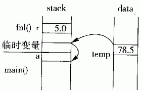
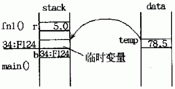
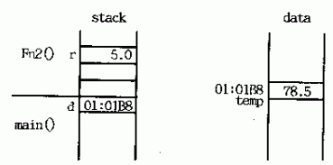
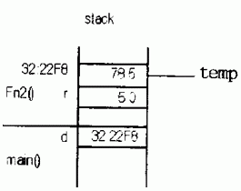

# 1 内存分区模型

C++程序在执行时，将内存大方向划分为**4个区域**

- 代码区：存放函数体的二进制代码，由操作系统进行管理的
- 全局区：存放全局变量和静态变量以及常量
- 栈区：由编译器自动分配释放, 存放函数的参数值,局部变量等
- 堆区：由程序员分配(new)和释放(delete),若程序员不释放,程序结束时由操作系统回收


**内存四区意义：**

不同区域存放的数据，赋予不同的生命周期, 给我们更大的灵活编程


### 1.1 程序运行前

​	在程序编译后，生成了exe可执行程序，**未执行该程序前**分为两个区域

​	**代码区：**

- 存放 CPU 执行的机器指令

- 代码区是**共享**的，共享的目的是对于频繁被执行的程序，只需要在内存中有一份代码即可
- 代码区是**只读**的，使其只读的原因是防止程序意外地修改了它的指令

​	**全局区：**

- 全局变量和静态变量存放在此.
- 全局区还包含了常量区, 字符串常量和其他常量也存放在此.
- ==该区域的数据在程序结束后由操作系统释放==


# 2 函数基础

函数定义包含以下几部分：

- 返回类型
- 函数名
- 参数列表
- 函数体（**返回值的数据类型与返回类型一致**）


## 2.1 局部静态变量

函数的形参和函数体内部定义的变量称为局部变量，在函数执行完毕后，形参的内存空间会被销毁，外部无法访问

某些时候，为了使得外部函数访问局部变量，可以在函数体内部定义**局部静态变量**。


## 2.2 参数传递

### 2.2.1 引用传递

当形参是引用类型时，则称它对应的实参被**引用传递**或者**传引用调用**，那么函数对这个参数的处理，实际上就是对实参的处理；

如果不是引用类型，则就是将实参==拷贝==一份并赋值给形参，函数对形参的操作不会影响到实参。

==如果函数无须改变参数的值，最好将形参声明为常量==

```c++
void test01(int& x){
    x = 4;
}
void test02(const int x){
    x = 10; // 报错，只能读取i，无法写
}
int main(){
	int a = 3;
    int b = 5;
    test01(a);
    cout << a << endl; // a = 4
    test02(b);
    cout << b << endl; // b = 5;
    return 0;
}
```

### 2.2.2 指针传递

参数是对象的指针形式，函数对指针进行操作，相当于间接对实参进行操作

```c++
void test03(int* x){
    *x = 5;
}
int main(){
    int c = 3;
    test03(&c);
    cout << c << endl; // c = 5
    return 0;
}
```


## 2.3 返回类型

### 2.3.1 返回引用

1.引用作为函数的返回值时，**必须在定义函数时在函数名前将&**

2.用引用作函数的返回值的**最大的好处是在内存中不产生返回值的副本**

3.函数返回引用既可以作为右值又可以作为左值

4.可以将返回的引用视为一个对象

```c++
flaot temp;

float fn1(float r) {
    temp = r*r*3.14;
    return temp;
}
float& fn2(float r) {
    temp = r*r*3.14;
    return temp;
}
void main()
{
    float a=fn1(5.0); //1
    float& b=fn1(5.0); //2:error
    float c=fn2(5.0); //3
    float& d=fn2(5.0); //4
}
```

有内存分区可知，全局变量`temp`在全局data区，其他函数在栈区。

（1）对于1而言，这种情况是一般的函数返回值方式。`float a=fn1(5.0); `



返回全局变量temp值时，C++创建**临时变量**，并将temp的值78.5复制给该临时变量。返回到主函数后，赋值语句`a=fn1(5.0)`把临时变量的值78.5==复制==给a。

即：函数返回值的方式会在内存空间进行一次复制操作，会增加时耗，对于某些自定义数据而言，会降低效率。


（2）对于2而言，这种情况下也是一般的函数返回值方式。`float& b=fn1(5.0);`



返回时， 复制temp的值给临时变量。返回到主函数后，引用b以该临时变量来初始化，使得b成为该临时变量的别名。

由于临时变量的作用域短暂，所以b面临无效的危险。 根据C++标准，临时变量或对象的生命期在一个完整的语句表达式结束后便宣告结束，也即在`float& b=fn1(5.0);`之后，临时变量不再存在。 

所以引用b以后的值是个无法确定的值。

若要以返回值初始化一个引用，应该先创建一个变量，将函数返回值赋给这个变量，然 后再以该变量来初始化引用，就像下面这样：

```c++
int x=fnl(5.0);
int& b=x;
```


（3）这种情况，函数fn2()的返回值**不产生副本**，所以， 直接将变量temp返回给主函数。`float c=fn2(5.0);`



主函数的赋值语句中的左值，直接从全局变量temp中得到复制，这样避免了临时变量的产生。==当变量temp是一个用户自定义的类型时，这种方式直接带来了程序执行效率和空间利用的利益。==


（4）这种情况， 函数fn2()返回一个引用，因此不产生任何返回值的副本。

`float& d = fn2(5.0);`



在主函数中，一个引用声明d用该返回值来初始化，使得d成为temp的别名。由于temp是全局变量， 所以在d的有效期内temp始终保持有效。这样做法是安全的。


（5）不能返回不在作用域范围内的变量或对象的引用。这与返回一个局部作用域指针的性质一样严重。例如，下面的代码返回一个引用，来给主函数的引用声明初始化：

```c++
float& fn2(float r){
    float temp; 
    temp=r*r*3.14;
    return temp; // 返回局部变量
}
void main(){
    // fn2执行完毕后，temp变量的内存空间被摧毁，引用 d 指向不明
    float &d=fn2(5.0); //error返回的引用是个局部变量
}
```


## 3 函数重载

同一作用域下，函数同名，但参数列表不同（参数类型不同、个数不同、顺序不同），称为**函数重载**。