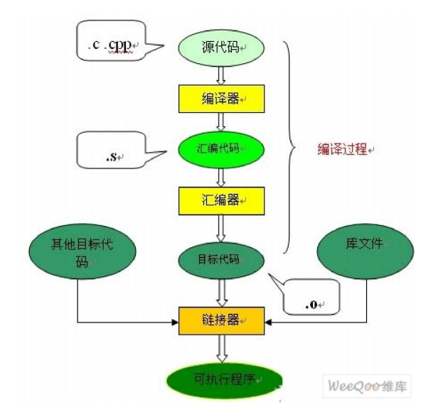

# C++ 编译阶段介绍

源程序到目标程序执行的四个阶段如图所示：预处理—->编译—->汇编—->链接。 

## 1 预处理阶段

预处理器(CPP)进行以下处理：

- `#include`头文件编译，被包含的文件插入到该预编译指令的位置
- 将宏（`#define`）定义的变量进行替换
- 处理条件编译指令，如`#ifdef`、`#ifndef`、`#else` 等

## 2 编译阶段

这个阶段编译器主要做词法分析、语法分析、语义分析等，在检查无错误后后，把代码翻译成汇编语言。

编译器(CCL)将文本文件 `*.i ` 翻译成文本文件 `*.s`, 它包含一个汇编语言程序。 

## 3 汇编阶段

汇编器(AS)将 `*.s` 翻译成机器语言保存在 `*.o`、`*.obj` 目标文件中（二进制文本形式），此过程会依赖机器的硬件和操作系统环境。

## 4 链接阶段

由汇编程序生成的目标文件并不能立即就被执行，其中可能还有许多没有解决的问题。

**通过链接器将一个个目标文件（或许还会有库文件）链接在一起生成一个完整的可执行程序。**==将生成的.obj文件与库文件.lib等文件链接，生成可执行文件（.exe文件）==

链接方式：

- 静态链接：函数的代码将从其所在地静态链接库中被拷贝到最终的可执行程序中。这样该程序在被执行时这些代码将被装入到该进程的虚拟地址空间中。
- 动态链接：函数的代码被放到称作是动态链接库或共享对象的某个目标文件中。链接程序此时所作的只是在最终的可执行程序中记录下共享对象的名字以及其它少量的登记信息。在此可执行文件被执行时，动态链接库的全部内容将被映射到运行时相应进程的虚地址空间。动态链接程序将根据可执行程序中记录的信息找到相应的函数代码。

不同平台下的链接：

- **dll .obj .lib使用在windows平台下**
  - .dll：动态链接库，作为共享函数库的可执行文件
  - .obj：对象文件，相当于源代码对应的二进制文件，未经重定位
  -  .lib：可理解为多个obj的集合，本质与.obj相同

- **.so .o .a使用在linux平台下**
  - .so：(share object)动态链接库，跟Windows平台类似
  -  .o： 对象文件，相当于源代码对应的二进制文件
  - .a： 静态库，多个对象文件的集合

# .h 头文件

类一般被定义在头文件中，且该头文件与类同名

头文件一般包含只能被定义一次的实体，如类、const变量等

头文件中也可以包含其他头文件

头文件那个不应包含 using 声明，这可能会造成命名冲突

# new 分配内存空间

