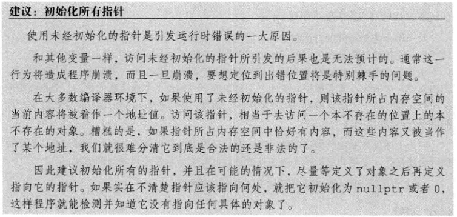

# 1 作用域 ::

在C++中，大多数作用域是指用花括号`{}`包围的那一块区域。

```c++
#include<iostream>
using namespace std;
int sum = 3;
int main(){
    int sum = 0;
    cout << sum << endl; 	// 0
    cout << ::sum << endl; 	// 3
    return 0;
}
```

在这段程序中，名字 main 定义在花括号之外，和其他函数名一样拥有**全局作用域（global scope）。**

局部变量 sum 拥有**块作用域（block scope）**，

局部变量 sum 可以==覆盖==全局作用域的全局变量 sum，要想访问全局作用域的sum，需要加上全局作用域符`::`。


# 2 引用 &

引用可以理解为给一个对象取别名，共享同一个内存空间，改变引用的值就改变了原变量的值。

```c++
int i = 3;
int& a = i; // 引用必须被初始化
```


# 3 指针 *

指针是一个对象，存放的是变量的地址，指针的数据类型与变量的数据类型必须==保持一致==。

利用指针访问变量时，需要在指针变量前加上**解引用符`*`**。

```c++
int i = 3;
int* p = &i; // 将整型变量 i 的地址存放到整型指针 p 中，定义时赋值地址
cout << *p << endl; // *p == i, 3
```

## 3.1 空指针

```c++
int* p = nullptr; // 等价于 int* p = 0;
或
int* p = NULL;
```




## 3.2 指向指针的指针

多级指针（`**`）指向的是前一级指针的内存地址，要想访问变量，则需要进行多级解引用。

```c++
int a = 3;
int* p1 = &a;
int** p2 = &p1;
cout << **p2 << endl; // 3
```

## 3.3 指向指针的引用 

==引用的数据类型必须与指向的对象的数据类型保持一致，==引用指向指针时，数据类型也为指针的类型。

```c++
int a = 3;
int* p;
int*& r = p; // r 相当于 p 指针
```


# 4 引用与指针的区别

引用：为变量取别名

- 定义引用时，**必须对引用进行初始化**；
- ==引用作为参数传递时，直接对引用的修改都会改变引用所指向的对象；==
- 引用只有一级引用（& p）；

指针：是一个对象，有自己的内存空间，存放的是变量的地址

- 定义指针时，可以不用进行初始化；

- 指针作为参数传递时，指针需要被解引用才可以对对象进行操作；
- 指针可以有多级指针（**p）；

- ==如果返回动态内存分配的对象或者内存，必须使用指针，引用可能引起内存泄露。==


# 5 限定符 const

`const` 对数据类型加以限定，限定后，变量无法修改，相当于定义了一个常量。

`const` 修饰的变量在**C++编译阶段**进行替换，因此==必须进行初始化==，否则就无法访问，编译会报错

当一个程序中包含多个文件，且每个文件都有`const`修饰的相同常量名，互不影响，如果多个文件想要共享同一`const`常量，则需要加上`extern`关键字

```c++
// file1.cpp
extern const int buf = 255; // 初始化 const 常量，buf 可以被其他文件访问
// file2.cpp
extern const int buf; // 声明 file1.cpp 中的 const 常量，fiel2.cpp 可以访问 buf
```

## 5.1 const 指针

弄清楚声明含义的方法是，==从右往左==读

```c++
int a = 3; // 整型变量
// 从右往左读：const p1 表示 p1 是个常量， * 表示指针，p1 是一个指向整型变量的指针常量
int* const p1 = &a;  // 无法修改 p1，但是可以修改 a

const int b = 2; // 整型常量，无法修改
// 从右往左读：* 表示指针，p2 是一个指向整型常量的常量指针
const int* p2 = &b; // 可以修改 p2

const double pi = 3.14; // 双精度常量，无法修改 pi
// 从右往左读：const p3 表示 p3 是一个常量， * 表示指针，p3 是一个指向双精度常量的常量指针
const double* const p3 = &pi; // 无法修改 p3
```

## 5.2 const优点

（1）const常量有数据类型，而宏常量没有数据类型。编译器可以对前者进行类型安全检查。而对后者只进行字符替换，没有类型安全检查，并且在字符替换可能会产生意料不到的错误。
（2）有些集成化的调试工具可以对const常量进行调试，但是不能对宏常量进行调试。
（3）const可节省空间，避免不必要的内存分配，提高效率。

## 5.3 const 与 #define 的区别

（1）就起作用的阶段而言： #define是在编译的预处理阶段起作用，而const是在 编译、运行的时候起作用。
（2）就起作用的方式而言： #define只是简单的字符串替换，没有类型检查。而const有对应的数据类型，是要进行判断的，可以避免一些低级的错误。 
（3）就存储方式而言：#define只是进行展开，有多少地方使用，就替换多少次，它定义的宏常量在内存中有若干个备份；const定义的只读变量在程序运行过程中只有一份备份。
（4）从代码调试的方便程度而言： const常量可以进行调试的，define是不能进行调试的，因为在预编译阶段就已经替换掉了。


# 6 auto 数据类型

`auto` 能够让编译器自动分析表达式所属的数据类型，因此`auto`定义的变量必须有初始值。

```c++
int a = 0;
int b = 3;
auto sum = a + b; // sum 是 int 型
auto i = 0;
auto *p = &i; // i 是整型，p 是整型指针
```

