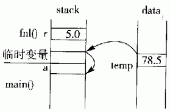
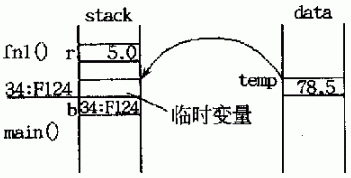
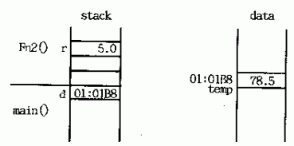
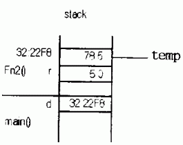

# 1 内存分区模型

C++程序在执行时，将内存大方向划分为**4个区域**

- 代码区：存放函数体的二进制代码，由操作系统进行管理的
- 全局区：存放**全局变量**和**静态变量**以及**常量**
- 栈区：由编译器自动分配释放, 存放函数的参数值,局部变量等
- 堆区：由程序员分配(new)和释放(delete),若程序员不释放,程序结束时由操作系统回收


**内存四区意义：**

不同区域存放的数据，赋予不同的生命周期, 给我们更大的灵活编程


### 1.1 程序运行前

​	在程序编译后，生成了exe可执行程序，**未执行该程序前**分为两个区域

​	**代码区：**

- 存放 CPU 执行的机器指令

- 代码区是**共享**的，共享的目的是对于频繁被执行的程序，只需要在内存中有一份代码即可
- 代码区是**只读**的，使其只读的原因是防止程序意外地修改了它的指令

​	**全局区：**

- 全局变量和静态变量存放在此.
- 全局区还包含了常量区, 字符串常量和其他常量也存放在此.
- ==全局const常量必须初始化==
- ==该区域的数据在程序结束后由操作系统释放==


# 2 函数基础

函数定义包含以下几部分：

- 返回类型
- 函数名
- 参数列表
- 函数体（**返回值的数据类型与返回类型一致**）


## 2.1 局部静态变量

函数的形参和函数体内部定义的变量称为局部变量，在函数执行完毕后，形参的内存空间会被销毁，外部无法访问

某些时候，为了使得外部函数访问局部变量，可以在函数体内部定义**局部静态变量**。


## 2.2 参数传递

### 2.2.1 引用传递

当形参是引用类型时，则称它对应的实参被**引用传递**或者**传引用调用**，那么函数对这个参数的处理，实际上就是对实参的处理；

如果不是引用类型，则就是将实参==拷贝==一份并赋值给形参，函数对形参的操作不会影响到实参。

==如果函数无须改变参数的值，最好将形参声明为常量==

```c++
void test01(int& x){
    x = 4;
}
void test02(const int x){
    x = 10; // 报错，只能读取i，无法写
}
int main(){
	int a = 3;
    int b = 5;
    test01(a);
    cout << a << endl; // a = 4
    test02(b);
    cout << b << endl; // b = 5;
    return 0;
}
```

### 2.2.2 指针传递

参数是对象的指针形式，函数对指针进行操作，相当于间接对实参进行操作

```c++
void test03(int* x){
    *x = 5;
}
int main(){
    int c = 3;
    test03(&c);
    cout << c << endl; // c = 5
    return 0;
}
```


## 2.3 返回类型

### 2.3.1 返回引用

1.引用作为函数的返回值时，**必须在定义函数时在函数名前加&**

2.用引用作函数的返回值的**最大的好处是在内存中不产生返回值的副本**

3.函数返回引用既可以作为右值又可以作为左值

4.可以将返回的引用视为一个对象

```c++
flaot temp;

float fn1(float r) {
    temp = r*r*3.14;
    return temp;
}
float& fn2(float r) {
    temp = r*r*3.14;
    return temp;
}
void main()
{
    float a=fn1(5.0); //1
    float& b=fn1(5.0); //2:error
    float c=fn2(5.0); //3
    float& d=fn2(5.0); //4
}
```

有内存分区可知，全局变量`temp`在全局data区，其他函数在栈区。

（1）对于1而言，这种情况是一般的函数返回值方式。`float a=fn1(5.0); `



返回全局变量temp值时，C++创建**临时变量**，并将temp的值78.5复制给该临时变量。返回到主函数后，赋值语句`a=fn1(5.0)`把临时变量的值78.5==复制==给a。

即：函数返回值的方式会在内存空间进行一次复制操作，会增加时耗，对于某些自定义数据而言，会降低效率。


（2）对于2而言，这种情况下也是一般的函数返回值方式。`float& b=fn1(5.0);`



返回时， 复制temp的值给临时变量。返回到主函数后，引用b以该临时变量来初始化，使得b成为该临时变量的别名。

由于临时变量的作用域短暂，所以b面临无效的危险。 根据C++标准，临时变量或对象的生命期在一个完整的语句表达式结束后便宣告结束，也即在`float& b=fn1(5.0);`之后，临时变量不再存在。 

所以引用b以后的值是个无法确定的值。

若要以返回值初始化一个引用，应该先创建一个变量，将函数返回值赋给这个变量，然 后再以该变量来初始化引用，就像下面这样：

```c++
int x=fnl(5.0);
int& b=x;
```


（3）这种情况，函数fn2()的返回值**不产生副本**，所以， 直接将变量temp返回给主函数。`float c=fn2(5.0);`



主函数的赋值语句中的左值，直接从全局变量temp中得到复制，这样避免了临时变量的产生。==当变量temp是一个用户自定义的类型时，这种方式直接带来了程序执行效率和空间利用的利益。==


（4）这种情况， 函数fn2()返回一个引用，因此不产生任何返回值的副本。

`float& d = fn2(5.0);`



在主函数中，一个引用声明d用该返回值来初始化，使得d成为temp的别名。由于temp是全局变量， 所以在d的有效期内temp始终保持有效。这样做法是安全的。


（5）不能返回不在作用域范围内的变量或对象的引用。这与返回一个局部作用域指针的性质一样严重。例如，下面的代码返回一个引用，来给主函数的引用声明初始化：

```c++
float& fn2(float r){
    float temp; 
    temp=r*r*3.14;
    return temp; // 返回局部变量
}
void main(){
    // fn2执行完毕后，temp变量的内存空间被摧毁，引用 d 指向不明
    float &d=fn2(5.0); //error返回的引用是个局部变量
}
```


## 2.4 函数重载

同一作用域下，函数同名，但参数列表不同（参数类型不同、个数不同、顺序不同），称为**函数重载**。

# 3 函数的分文件编写

**作用：**让代码结构更加清晰

函数分文件编写一般有4个步骤

1. 创建后缀名为.h的头文件  
2. 创建后缀名为.cpp的源文件
3. 在头文件中写函数的声明
4. 在源文件中写函数的定义

**示例：**

```C++
//swap.h文件
#include<iostream>
using namespace std;

//实现两个数字交换的函数声明
void swap(int a, int b);

```

```C++
//swap.cpp文件
#include "swap.h"

void swap(int a, int b)
{
	int temp = a;
	a = b;
	b = temp;

	cout << "a = " << a << endl;
	cout << "b = " << b << endl;
}
```

```C++
//main函数文件
#include "swap.h"
int main() {

	int a = 100;
	int b = 200;
	swap(a, b);

	system("pause");

	return 0;
}
```


# ==4 回调函数==

**什么是回调函数？**

首先回调函数就是一个函数，它在形式上和其他函数没有区别，同样可以有参数和返回值。只不过这个所谓的回调函数的函数指针是将要被当做参数传递给另一个函数的，并被其调用。这时，我们就称这个被当做参数传递的函数为回调函数。

简单的说："回调函数就是一个通过指针调用的函数，如果把函数指针作为参数传给另一个函数，当这个指针被用来调用所指向的函数时，我们就说这是回调函数。"

**回调函数有什么作用？我们为什么要使用回调函数？**

上面说到回调函数是把它的函数指针做为参数被调用，那么问题来了，为什么我们要把函数作为参数来调用呢，直接在函数体里面调用不行吗？也就是为什么我们要使用回调函数呢？其实“把函数做成参数”和“把变量做成参数”目的是一致的，就是以不变应万变。形参是不变的，而实参是变的。

在知乎上看到一个举例，非常形象的解释了回调函数：假设你到一个商店买东西，刚好你要的东西没有货，于是你在店员那里留下了你的电话，过了几天店里有货了，店员就打了你的电话，然后你接到电话后就到店里去取了货。在这个例子里，你的电话号码就叫回调函数，你把电话留给店员就叫登记回调函数，店里后来有货了叫做触发了回调关联的事件，店员给你打电话叫做调用回调函数，你到店里去取货叫做响应回调事件。

也就是说回调函数的作用就是，我们先在回调函数中定义当当一件我们不知道什么时候会发生的事件发生时需要干什么，当事件发生时，我们就可以调用回调函数处理这个事件。

**什么时候使用回调函数？**

一般在数据和网络通信中，当我们通信或数据传输时，由于我们不知道什么时候通信和数据传输会结束或者会中断，但是我们需要在结束或者中断时让程序得到相应的通知，并执行相应的动作。此时，就需有一个回调函数来进行回调，通知我们的程序事件已经发生，执行相应的动作。

另一种比较常用到的情况是，假设我们要编写一个库，它提供了某些排序算法的实现，如冒泡排序、快速排序、shell排序、选择排序等等，为了使库更加通用，可用于多种数据类型（int、float、string、char *），此时，该怎么办呢？可以使用函数指针，并进行回调。

**怎么使用回调函数？**

回调函数相当于一个中断处理函数，由系统或其他函数在符合我们设定的条件时自动调用。为此，我们需要做三件事：1，声明；2，定义；3，设置触发条件。就是在你的函数中把你的回调函数名称转化为地址作为一个参数，以便于系统调用。


## 4.1 函数指针

定义一个函数，其**函数类型是由返回类型以及参数共同决定**

**函数名**相当于是这个**函数类型的变量名**

因此，函数也是存放在内存空间中的，可以使用指针来指向这段内存

- 定义一个普通指针：

```c++
int *p;		// 定义一个int类型指针，变量名为p
int a = 3;	// 定义一个int类型，变量名为a
p = &a;		// 初始化指针，指向一段内存空间
```

-  定义一个普通函数：

```c++
int add(int a, int b);
```

- 定义一个函数指针：想声明一个指向这类函数的指针，只需用==指针替换函数名（需要加括号），并指定一样的参数类型==：

> `pf`前面有`*`，说明`pf`是指针，右侧是形参列表，表示`pf`指向的是函数，左侧为`int`，说明`pf`指向的**函数返回值**为`int`类型；`pf`可指向`int(int,int)`类型的函数

```c++
int (*pf)(int, int);	// 定义一个函数指针pf，指向的函数类型是int(int, int)
```

- 通常使用`typedef`定义一个函数指针：

```c++
typedef int (*PF)(int, int); // 为int(*)(int, int)函数指针类型取别名为：PF
PF pf; // 定义一个函数指针 pf
pf = add; // 初始化函数指针，指向一段内存空间
```

- 初始化函数指针，赋值对象必须是返回类型一致，参数列表一致的具体函数：

> add函数类型为int(int,int)，则pf可指向add函数

```c++
pf = add;
```

- 使用函数指针：

```c++
pf(2, 3);
// 或者
(*pf)(2, 3);	// (*)必不可少
```


==注意：定义函数指针时，必须加上()==

```c++
int *pf(int, int); //pf是一个返回值为int*的函数，而非函数指针

int (*pf)(int, int); // int(*)(int, int)是函数指针，pf是指针变量名
```

## 4.2 回调函数

**概念：**回调函数，顾名思义，就是定义一个函数，然后把这个函数==作为参数==传入其他的函数中，由其他函数在运行时来调用

传入的参数形式：**函数指针**

```c++
#include <stdio.h>
#include <stdlib.h>

typedef int (*PF)(int, int);

int add(int a, int b)
{
    return a+b;
}

// 传入函数指针
void useCallback(int (*callback)(int, int), int a, int b)
{
    int num = callback(a, b);
    printf("%d\n", num);
}

// typedef取别名
void useCallback2(PF callback, int a, int b)
{
    int num = callback(2, 3);
    printf("%d\n", num+2);
}

int main(int argc, char const *argv[])
{
    useCallback(add, 2, 3);
    useCallback2(add, 2, 3);
    return 0;
}
```

