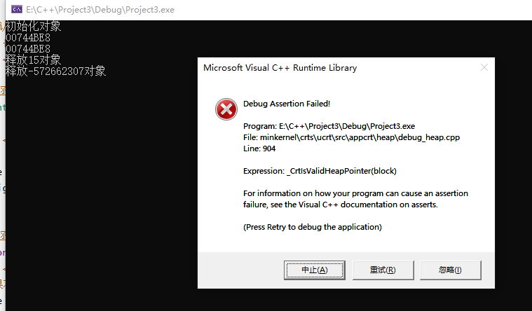
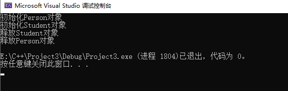
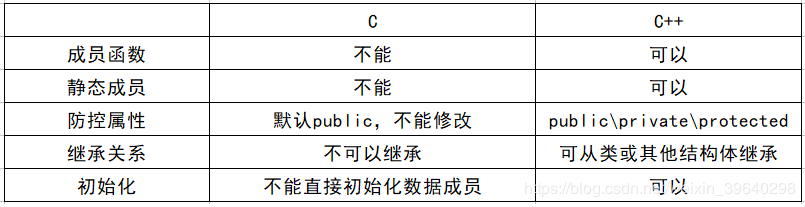

# 1 结构体 struct

```c++
struct Person{
    string name;
    int age;
}p1; // 预先定义，Person p1;
// 实例化
Person p2 = {"Bob", 12};
```


# 2 类 class

C++面向对象的三大特性为：封装、继承、多态。

### 补充：类外初始化

可以在类外初始化成员变量和成员函数，主要是要声明所在的**作用域**。

```c++
class Person {
public:
    string name;
    int age;
    // 类内声明
    Person(string name, int age) {};
    void print_info() {};
};
// 类外初始化
Person::Person(string name, int age) {
    this->name = name;
    this->age = age;
}
void Person::print_info() {
    cout << this->name << endl;
}
```


### 补充：this 指针

this指针是隐含每一个非静态成员函数内的一种指针

**this 指向的是被调用的成员函数所属的对象**


this指针的用途：

*  当形参和成员变量同名时，可用this指针来区分
*  在类的非静态成员函数中返回==对象本身==，可使用return *this


### 补充：静态成员

在成员前加上`static`关键字后，该成员就是静态成员，静态成员有以下特点：

- 静态成员变量：
  - 所有对象共享同一份数据
  - 在编译阶段分配内存
  - ==类内声明，类外初始化==

- 静态成员函数：
  - 所有对象共享同一个函数
  - 静态成员函数只能访问静态成员变量

总的来说，静态成员存储在全局区，相当于全局变量。


### 补充：const 修饰

`const`关键字是用来表示常量的

成员函数**后面**加上`const`关键字之后就成为了常函数，常函数有以下特点：

- 不可以修改成员变量
- 要想修改成员变量，需要在成员变量前加上`mutable`关键字


**声明对象前**加上`const`关键字之后就是常对象，常对象有以下特点：

- 声明对象前加上`const`
- **常对象只能调用常函数**
- 可以访问其他成员变量，不可以修改
- 要想修改成员变量，需要在成员变量前加上`mutable`关键字

```c++
class Person {
public:
    string name;
    mutable int age;
    void print_info() const{ // 常函数，只能修改 mutable 成员变量
        this->age = 13;
        cout << this->age << endl;
    };
};

const Person p; // 常对象
p.print_info(); // 只能调用常函数
```


### 补充：final

如果不想让一个类被其他类所继承，可以在定义时加上`final`关键字

```c++
class A final {};
```


如果不想让子类重写虚函数，可以在定义时加上`final`关键字

```c++
class A
{
public:
    virtual void fn1(int) final;
}
class B: public A
{
    void fn1(int);	// 错误，final修饰的函数无法重写
}
```


## 2.1 封装

将成员（属性）和方法==加以权限==封装在一起，形成一个对象。

```c++
class Person {
public:
    string name;
    int age;
    Person(string name, int age){
        this->name = name;
        this->age = age;
    }
};

Person p;
```


### 2.1.1 权限

- 公共权限  public     类内可以访问  类外可以访问
- 保护权限  protected  类内可以访问  类外不可以访问
- 私有权限  private    类内可以访问  类外不可以访问

类内是指，类中的成员函数

类外是指，类对象或其他外部对象


protected 和 private 的区别：有继承时，子类内部可以访问protected 权限的内容，而无法访问 private 权限的内容。

class的成员**默认**是private权限


### 补充：friend 友元

如果类外的**全局函数**、**其他类**或**其他类的成员函数**想要访问类内的protected和private，则可以在类内声明友元`friend`

```c++
void Goodgay(){};
class goodGay{
public:
	void visit();
};
class Building{
    friend void Goodgay(); // 全局函数作为友元
    friend class goodGay; // 类作为友元
    friend void goodGay::visit(); // 成员函数作为友元
public:
    ...
private:
    ...
}
```


### 2.1.2 构造函数和析构函数

对象的**初始化和清理**也是两个非常重要的安全问题

一个对象或者变量没有初始状态，对其使用后果是未知，同样的使用完一个对象或变量，没有及时清理，也会造成一定的安全问题。

c++利用了**构造函数**和**析构函数**解决上述问题，这两个函数将会被编译器==自动调用==，完成对象初始化和清理工作。

对象的初始化和清理工作是编译器强制要我们做的事情，因此如果**我们不提供构造和析构，编译器会提供**

**编译器提供的构造函数和析构函数是空实现。**

```c++
class Person {
public:
    Person() {
        cout << "初始化对象" << endl;
    }
    ~Person() {
        cout << "释放对象" << endl;
    }
};
```

**构造函数**：==主要作用在于创建对象时为对象的成员属性赋值==

- 如果类中没有显示定义构造函数，编译器会自动提供一个默认构造函数用于初始化

- 与类同名
- 可以重载（函数名相同，参数列表不同）

**析构函数**：==主要作用在于对象**销毁前**系统自动调用，执行一些清理工作==

- 使用`~`表示析构
- 一个类中只能有一个析构函数，无法重载


默认情况下，c++编译器至少给一个类添加3个函数

1．默认构造函数(无参，函数体为空)

2．默认析构函数(无参，函数体为空)

3．默认拷贝构造函数，对属性进行值拷贝


### 2.1.3 三种构造函数

- 无参构造函数，`Person p;`
- 有参构造函数，`Person p("aaa");`
- 拷贝构造函数是构造函数的一种重载方式，接收的参数是**类引用**，函数体内部实现**成员变量的深拷贝**操作。


构造函数调用规则如下：

* 如果用户定义有参构造函数，c++不会提供默认无参构造，但是会提供默认拷贝构造（==浅拷贝==）


* 如果用户定义拷贝构造函数，c++不会再提供其他构造函数，此时需要自己定义另外的构造函数

```c++
class Person {
public:
    string name;
    Person() {
        cout << "无参构造函数" << endl;
    }
    Person(string name) {
        this->name = name;
        cout << "有参构造函数" << endl;
    }
    Person(const Person& p) {// 将 p 的成员变量赋值给当前对象
        this->name = p.name;
    }
    ~Person() {
        cout << "释放对象" << endl;
    }
};

Person p1("aaa");
Person p2 = p1; // Person p2(p1); 
cout << p2.name << endl; // aaa
```


### 2.1.4 浅拷贝和深拷贝

浅拷贝问题在于：==当类中的有**指针成员变量**时，内存空间会存在重复释放的问题。==

- 浅拷贝：多个对象共用同一块资源，同一块资源释放多次，重复释放会导致系统崩溃
- 深拷贝：在堆区为指针成员变量重新申请空间，进行赋值操作

```c++
// 浅拷贝
class Person {
public:
    int* num;
    Person(int num) {
        this->num = new int(num); // 为变量开辟内存空间，返回的是指向该内存空间的一个指针
        cout << "初始化对象" << endl;
    }
    ~Person() {
        cout << "释放" << *(this->num) <<  "对象" << endl;
        delete this->num; // 释放内存空间
    }
};

Person p1(15); // 初始化 p1
Person p2(p1); // 自带的拷贝构造函数实现的是浅拷贝，p2与p1共享同一块内存空间
cout << p1.num << endl;
cout << p2.num << endl;
```

代码运行后，调用一次构造函数，调用两次析构函数，两个对象的指针成员变量所指的内存空间相同，num指针被分配一次内存，但是程序结束时该内存却被释放了两次，会导致崩溃！




```c++
// 深拷贝
class Person {
public:
    int* num;
    Person(char num) {
        this->num = new int(num);
        cout << "初始化对象" << endl;
    }
    Person(const Person& p) {
        cout << "拷贝构造函数" << endl;
        this->num = new int(*p.num); // 深拷贝，为成员变量开辟新的内存空间
    }
    ~Person() {
        cout << "释放" << *(this->num) <<  "对象" << endl;
        delete this->num;
    }
};

int main() {
    Person p1(15);
    Person p2(p1);
    cout << p1.num << endl;
    cout << p2.num << endl;
    return 0;
}
```

代码运行后，p1和p2两个对象的指针成员变量有了各自的内存空间，这样就不会重复释放资源。


### 2.1.5 析构顺序

当类中有其他类作为成员，或子类继承父类时，构造函数（初始化）和析构函数（销毁内存）的生成顺序是：

- 类中包含类成员：先调用类成员的构造，再调用本类构造
- 继承关系：父类先构造，子类先析构

```c++
// 继承
class Person {
public:
    Person() {
        cout << "初始化Person对象" << endl;
    }
    ~Person() {
        cout << "释放Person对象" << endl;
       
    }
};
class Student: public Person {
public:
    Student() {
        cout << "初始化Student对象" << endl;
    }
    ~Student() {
        cout << "释放Student对象" << endl;
    }
};

// 类中含有类成员
class Student {
public:
    Person p;
    Student() {
        cout << "初始化Student对象" << endl;
    }
    ~Student() {
        cout << "释放Student对象" << endl;
    }
};

Student s;
```




## 2.2 继承

```c++
class A{};
class B: 继承方式 A{};
```

继承方式共有3种：

- public：公共继承，外部可以访问子类的public，子类内部可以访问public、protected，不可以访问private
- protected：保护继承，外部不可以访问这个子类，子类内部可以访问public、protected，不可以访问private
- private：私有继承，外部不可以访问这个子类，子类内部可以访问父类的public、protected成员，不可以访问private

简单来说，外部是否可以访问该子类的成员，关键是看子类的继承方式，如果是public继承，则可以访问父类的public，其他两种方式均不可访问。


### 2.2.1 继承中出现同名成员

当父类和子类出现同名成员变量或成员函数时，若想使用父类的成员，需要加上父类的**作用域**。


## 2.3 ==多态==

多态分为两类

* 静态多态: 函数重载 和 运算符重载属于静态多态（重载是指函数名相同，参数列表不同）
* 动态多态: 子类和虚函数实现运行时多态


静态多态和动态多态区别：

* 静态多态的函数地址早绑定  -  编译阶段确定函数地址
* 动态多态的函数地址晚绑定  -  运行阶段确定函数地址


动态多态满足需要满足以下条件：

- 有继承关系
- 父类有虚函数，子类**重写**父类中的虚函数

多态使用：==父类指针或引用调用一个虚函数==

虚函数的调用是在运行时才被编译器解析的，所以称为动态多态


### 重载与（动态）多态的区别

多态是基于对抽象方法的覆盖来实现的，==用统一的对外接口来完成不同的功能==。重载也是用统一的对外接口来完成不同的功能。那么两者有什么区别呢？

重载，是指允许存在多个同名方法，而这些方法的参数不同。重载的实现是：编译器根据方法不同的参数表，对同名方法的名称做修饰。对于编译器而言，这些同名方法就成了不同的方法。它们的调用地址在编译期就绑定了。

多态：是指子类重新定义父类的虚方法（virtual,abstract）。当子类重新定义了父类的虚方法后，父类根据赋给它的不同的子类，动态调用属于子类的该方法，这样的方法调用在编译期间是无法确定的。

不难看出，两者的区别在于编译器何时去寻找所要调用的具体方法，对于重载而言，在方法调用之前，编译器就已经确定了所要调用的方法，这称为“早绑定”或“静态绑定”；而对于多态，只有等到方法调用的那一刻，编译器才会确定所要调用的具体方法，这称为“晚绑定”或“动态绑定”。 

原文链接：https://blog.csdn.net/weigb/article/details/1864192

### 2.3.1 虚函数

虚函数的关键字是`virtual`，在函数前加上`virtual`就是虚函数

==注意：==

- 在父类中定义了虚函数，子类可以不重写
- **虚函数只能重写不能重载**

```c++
class Animal{
public:
	//函数前面加上virtual关键字，变成虚函数，那么编译器在编译的时候就不能确定函数调用了。
	virtual void speak(){
		cout << "动物在说话" << endl;
	}
};

class Cat :public Animal{
public:
	void speak(){ // 重写父类的虚函数
		cout << "小猫在说话" << endl;
	}
};

class Dog :public Animal{
public:
	void speak(){ // 重写父类的虚函数
		cout << "小狗在说话" << endl;
	}
};

void DoSpeak(Animal & animal){//多态的使用，父类的引用指向子类对象 cat、dog
	animal.speak();
}
Cat cat;
DoSpeak(cat); // cat.speak();
Dog dog;
DoSpeak(dog); // dog.speak();
```


### 补充：override

如果子类重载了父类的虚函数，编译器认为这是合法行为，但是实际上子类并没有重写虚函数，因此很难进行调试，使用`override`关键字，可以来判断子类是否正确重写了父类的虚函数

==注意：override只能用于判断重写的虚函数==

```c++
struct B
{
    virtual void f1(int) const;
    virtual void f2();
    void f3();
};
struct D1: B
{
    void f1(int) const override; //正确，子类正确重写了父类的虚函数f1
    void f2(int) override; 		 //错误，父类的虚函数f2没有参数，相当于重载了虚函数
    void f3() override; 		 //错误，父类的f3不是虚函数，无法使用override关键字来判断
}
```


### 2.3.2 抽象类

一般情况下，多态都是在子类重写父类的虚函数实现的，即父类的虚函数意义不大，因此可以将父类的虚函数改写为==纯虚函数==，当父类中出现纯虚函数，则这个父类就是一个==抽象类==。

语法：`virtual 返回类型 函数名(参数列表) = 0;`

抽象类的特点：

- 类中有一个纯虚函数
- 抽象类无法实例化
- 子类必须重写父类中的纯虚函数，否则也属于抽象类

```c++
class Animal{
public:
	//函数前面加上virtual关键字，变成虚函数，那么编译器在编译的时候就不能确定函数调用了。
	virtual void speak() = 0;
};
```


### 2.3.3 虚析构和纯虚析构

多态使用时，如果子类中有属性开辟到堆区，那么父类指针在释放时无法调用到子类的析构代码，此时就会造成内存崩溃、系统资源浪费的情况：

```c++
class Animal {
public:
    Animal() {
        cout << "Animal构造函数" << endl;
    }
    virtual void speak() = 0; // 虚函数
    ~Animal() {
        cout << "Animal释放" << endl;
    }
};

class Cat :public Animal {
public:
    int* num;
    Cat(int num) { // 在子类中开辟新的内存空间
        this->num = new int(num);
        cout << "Cat构造函数" << endl;
    }
    void speak() { // 重写虚函数
        cout << *this->num << " cat speaking" << endl;
    }
    ~Cat() {
        cout << "Cat释放" << endl;
        delete this->num;
    }
};

Animal* animal = new Cat(12); // 多态的使用：父类指针指向子类对象
animal->speak(); // Cat.speak();
delete animal; // 释放堆区
```


如图，Cat的析构函数没有被调用，此时没有释放子类开辟的内存空间，造成内存泄漏。


==解决方法：==将父类中的析构函数改为**虚析构**或者**纯虚析构**即可。

```c++
class Animal {
public:
    Animal() {
        cout << "Animal构造函数" << endl;
    }
    virtual void speak() = 0; // 虚函数
    /*virtrual ~Animal() { // 虚析构
        cout << "Animal释放" << endl;
    }*/ 
    virtual ~Animal() = 0; // 纯虚析构
};
```


# 3 类的分文件编写

**作用：**让代码结构更加清晰

类分文件编写一般有4个步骤

1. 创建后缀名为.h的头文件（与类同名）
2. 创建后缀名为.cpp的源文件（与类同名）
3. 在.h头文件中写类的声明
4. 在.cpp源文件中写类的定义

**示例：**

```C++
// WorkerManger.h
#pragma once
#include<iostream>
using namespace std;
class WorkerManager{
public:
	//构造函数
	WorkerManager();
	//析构函数
	~WorkerManager();
};
```

```C++
#include "workerManager.h"
WorkerManager::WorkerManager(){
}

WorkerManager::~WorkerManager(){
}
```

```C++
//main函数文件
#include "WorkerManager.h"
int main() {
}
```


# 4 struct 和 class 

## 3.1 C 和 C++ 的 struct 

`struct` 关键字是C里面的，C是面向过程，使用struct相当于定义了一个数据结构，C++中的`struct`对C中的进行了扩充，主要区别如图所示：



## 3.2 C++ 的 struct 和 class

在C++中引入 `struct` 是为了保持对C程序的兼容，在引入之后C++对其进行了扩充，现在struct可以拥有静态成员、成员数据可进行初始化、拥有函数、也可以继承、甚至多态也支持。

从表面看起来两者之间像是没有区别，有时你把程序中的所有class改为struct，程序也照常运行，但仍然有区别：

- （1）struct默认防控属性是public，而class默认的防控属性是private

```c++
struct A{
	int iNum;
};
class B{
	int iNum;
};
A a;
a.iNum = 2;		//没有问题，默认防控属性为public
B b;
b.iNum = 2;		//编译报错，无法访问，默认防控属性为private
```

- （2）在继承关系，struct默认是public的，而class是private

```c++
struct A{};
struct B: A{}; // 默认为 public 继承
class C{};
class D: public C{}; // 需要指定 public 继承方式，否则为 private 继承
```

- （3）class关键字还可用于定义模板参数，但是strcut不用与定义模板参数

```c++
template< typename T, typename Y >	//可以把typename 换成 class
int  Func( const T& t, const Y& y ){};
```
