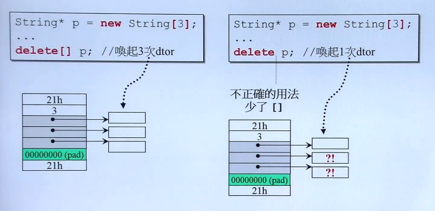

# 头文件 .h 和 源文件 .cpp

头文件：用于声明类

源文件：包含头文件，可以调用头文件中声明的类


# 创建头文件

语法：需要防卫式声明，一般是头文件名的大写

```c++
#ifndef __COMPLEX__
#define __COMPLEX__


#endif
```


# 模板

在定义函数或类时，如果不知道要使用的参数是什么类型时，可以使用模板函数或模板类

==详见【./C++基础/04.类的高级用法】==


# 类

通常，编写类时，会分为以下两种类型：

- 成员变量无指针的类（通常不用写析构函数）

- 船员变量有指针的类（通常要写析构函数）

# 不带指针的类

> 【示例】定义一个复数（complex）类

```c++
class complex
{
public:
    complex(double r = 0, double i = 0): re(r), im(i) {}
    complex& operator += (const complex&);
    double real() const {return re;}
    double imag() const {return im;}
private:
    double re, im;
   	friend complex& __doapl(complex*, const complex&);	// 声明友元
}

inline
complex& __dopal(complex * ths, const complex& r)
{
    ths->re += r.re;
    ths->im += r.im;
    return *ths;
}

inline
complex& complex::operator += (const complex& r)	// 重载+=操作符
{
    return __dopal(this, r);
}
```


## 权限控制

有三种权限：public, private, protected

**一般会把成员变量放在private中，类外可以访问的成员函数放在public中**


## 构造函数

- 构造函数的名字与类同名，无返回值
- 尽量使用构造函数特有的初始化方法
- 构造函数可重载（函数名相同，参数列表不同）
- 类会提供默认的构造函数，但是一旦人为重载了构造函数，默认构造函数就不会生成，需要显式定义
- 可以把构造函数放在private中（**设计模式：Singleton**）


## 成员函数

类中，可以声明两类成员函数（内联函数）：

- 普通成员函数（改变数据内容）
- **常量**成员函数（不会改变数据内容），==详情见【../关键字/const关键字】==


### 函数参数传递

- 传递指针 `*`
- 传递引用 `&`，**尽量都传引用**
- 传递常量引用 `const &`，如果函数不对数据进行修改，就加上`const`修饰


### 函数返回值传递

- 返回普通值
- 返回指针
- 返回引用，**尽量返回引用，return一个值**，==不能返回局部变量的引用==


==TIPS:如何判断是否可以返回引用？==

如果返回的是函数体内的一个局部变量，那么只能返回值

如果返回的值赋值到了参数列表的某一个变量中，那么就能返回这个变量的引用


## 友元 friend

- 在类中声明的友元，可以访问类中的private数据

- 相同的class的各个对象互为友元


# 重载操作符

可以在**类内**实现重载操作符的**成员函数**，也可以在**类外**实现重载操作符的**非成员函数**

对于<< 、>>操作符，只能在全局进行重载 

```c++
inline 
complex operator + (const complex& x, const complex& y)
{
    return complex(x.re + y.re, x.im + y.im);
} // 注意，此处不能返回引用，因为返回值是一个局部变量（这是一个临时对象的写法）
```


==详见【./C++基础/04.类的高级用法】==


## 临时对象

不给对象定义变量名：`typename();`

如：`int(3)`、`complex(3, 2)`

临时对象的生命周期是在执行完这一句后就消失


# 带指针的类

> 【示例】定义一个string类

```c++
class String
{
public:
    String(const char* cstr=0);				// 构造函数
    String(const String& str);				// 拷贝构造
    String& operator=(const String& str);	// 拷贝赋值
    ~String();								// 析构函数
    
    char* get_c_str() const { return m_data; }
private:
    char* m_data;    
}

inline
String::String(const char* cstr=0)
{
    if(cstr)
    {
        m_data = new char[strlen(cstr) + 1];
        strcpy(m_data, cstr);
    }
    else
    {
        m_data = new char[1];
        *m_data = '\0';
    }
}

inline
String::~String()
{
    delete[] m_data;
}

inline
String& String::operator=(const String& str)
{
    if(this == &str)	// 检测自我赋值
        return *this;
    delete[] m_data;
    m_data = new char[strlen(str.m_data) + 1];
    strcpy(m_data, str.m_data);
    return *this;
}
```


## 拷贝构造、拷贝赋值

- 类一旦被创建就会默认提供拷贝构造、拷贝赋值和析构函数

- 对于不带指针的类，不需要重写拷贝构造和拷贝赋值

- 带指针的类则必须要重写拷贝构造函数和拷贝赋值函数


拷贝构造的参数是自身一个类对象

拷贝赋值是重写=赋值运算符，参数也是自身一个类对象

拷贝构造和拷贝赋值都是创建对象的一种方法，通常都要一起实现

==详见【./C++基础/03.类和对象】==


## 析构函数

- 析构函数是在类对象离开作用域后自动调用的

- 只要在类中动态分配了指针的内存空间，就需要使用析构函数来释放这块内存空间


# 内存管理

代码有几个生命周期：

- 全局区（存放静态变量、全局变量），程序结束时才释放

- 栈区（存放普通变量），离开作用域后自动释放
- 堆区（人为分配），不自动释放，需要人为释放


## new 和 malloc

```c++
Complex* pc = new Complex(1, 2);

// 编译器转化为以下几步：先分配再构造

Complex* pc;
void* mem = operator new(sizeof(Complex));	// 分配内存
pc = static_cast<Complex*>(mem);			// 转换数据类型
pc->Complex::Complex(1, 2);					// 构造函数
```


## delete 和 free

```c++
String* ps = new String("Hello");
delete ps;

// 编译器转化为以下几步：先析构再释放

String::~String(ps);	// 析构函数
operator delete(ps);	// 释放内存，delete函数内部调用了free(ps)
```


## new数组一定要搭配delete[]

左右两个delete都是释放指针p所指向的内存空间（p的地址为21h）

右边的delete只释放了第一块动态分配的内存，另外两块内存并没有被释放

左边的delete会释放所有的内存




# 补充：static成员

- 只要是static修饰的成员，一旦被调用就保存在了静态区，直到程序结束时才会消失

- 静态成员是共享的

- 静态成员在类内声明，类外初始化

==详见【./C++基础/03.类和对象】==


# 补充：namespace

标准库的所有内容封装在了`namespace std`中

```c++
namespace std	// std 是命名空间的名字
{
    cout;
    cin;
    enl;
    ...
}
```

使用namespace

```c++
// 方法一：using directive
using namespace std;	// 将std中的所有东西都拿来

// 方法二：using declaration
using std::cout;		// 使用单独
```