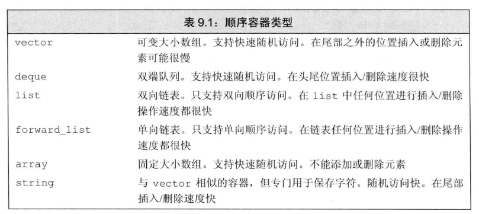
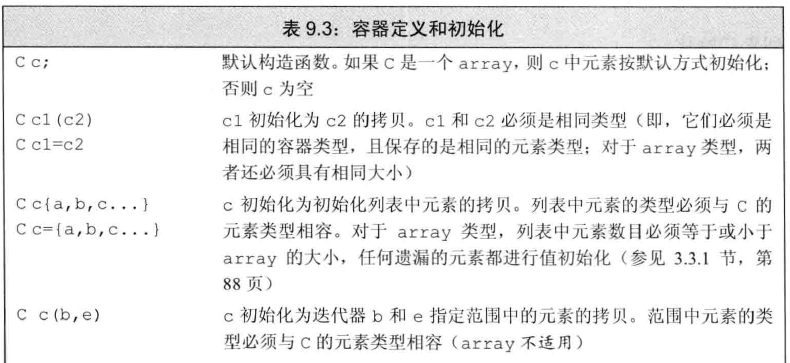
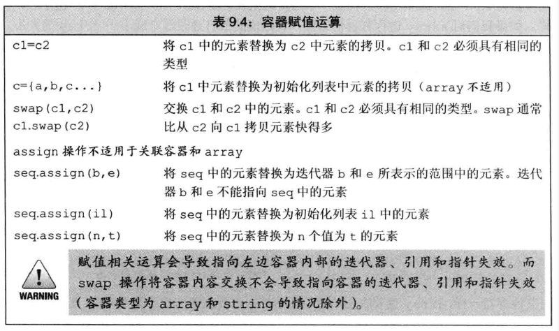
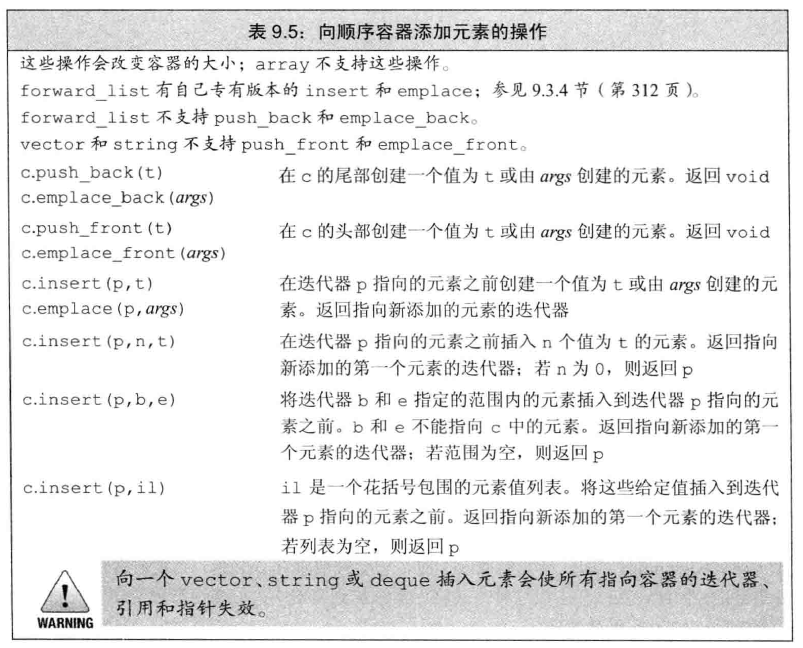
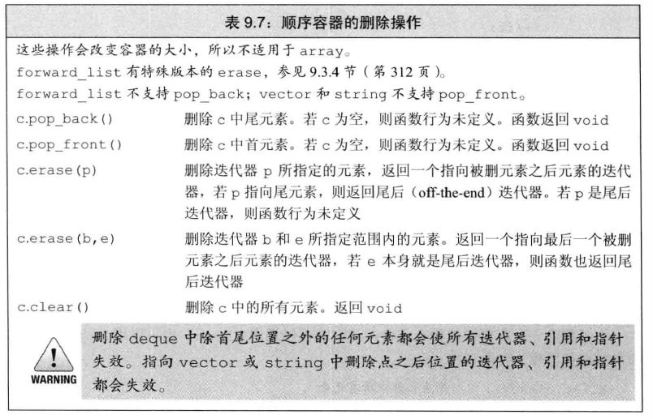
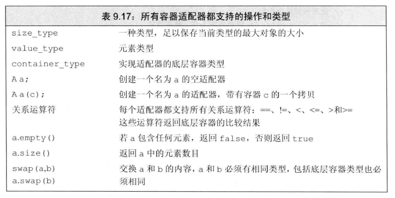
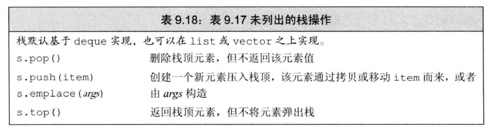
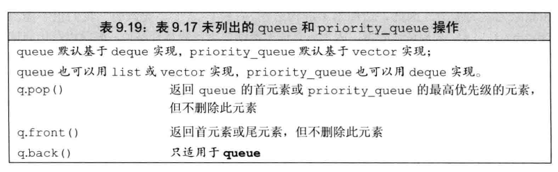
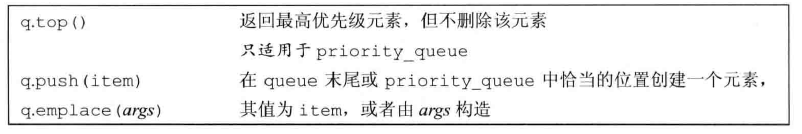

# 1 STL基本概念

STL（Standard Template Library），标准模板库

STL几乎所有的代码都采用了模板类或者模板函数

STL分为以下六大组件：

- 容器：用于存放数据的各种数据结构，如vector, list, deque, set, map, string等
- 算法：处理数据的常用算法，如sort, find, copy, for_each等
- 迭代器：类似指针
- 仿函数：类似函数，可作为算法的某种策略
- 适配器：一种用来修饰容器、仿函数、迭代器接口的东西
- 空间适配器：负责空间的配置与管理


# 2 容器

STL容器就是实现的一些数据结构，如：数组、链表、栈、队列、集合、映射表等

这些容器分为**顺序容器**和**关联容器**

==二者的本质区别：==

顺序容器中的元素是按照它们在容器中的位置来顺序保存和访问的

关联容器中的元素是按照关键字来保存和访问的


顺序容器：vector, string, deque, list, forward_list, array

关联容器：pair, set, map



- vector 和 string 将元素保存在**连续**的内存空间
  - 用下标访问会非常快，支持随机访问
  - 在中间添加或删除元素会非常耗时
  - 添加一个元素时还有可能需要重新分配额外的内存空间
- list 和 forward 是链表的数据结构，内存空间可以不连续
  - 在任何位置添加或删除元素都很快速
  - 由于地址不连续，故不支持元素的随机访问，访问一个元素时，需要遍历整个容器
  - 相比于vector 和 deque内存开销大
- deque 可以看作 vector 的高级版本，支持在两端添加或删除元素
  - 在中间添加或删除元素时也会非常耗时


## 2.1 顺序容器通用操作

假设有容器C，一般都有会有以下几种公共操作：

### 2.1.1 定义和初始化



### 2.1.2 大小

```c++
c.size();		// c中元素个数
c.max_size();	// c可保存的最大元素数目
c.empty();		// 若c中有元素，返回false；否则返回true

c.resize(n);	// 调整c的大小为n个元素，多出的元素被丢弃
c.resize(n,t);	// 调整c的大小为n个元素，元素初始化为t
```

### 2.1.3 获取迭代器

```c++
c.begin();				// 返回指向c的首元素的迭代器
c.end();				// 返回指向c的尾元素后一个位置的迭代器
c.cbegin();c.cend();	// 返回const_iterator
```

### 2.1.4 赋值与swap

swap 操作用于交换两个**相同类型**容器的内容



### 2.1.5 添加、插入元素




### 2.1.6 访问元素

```c++
c.back();	// 返回c中尾元素的引用 (不支持forward_list)
c.front();	// 返回c中首元素的引用
c[n];		// 使用下标访问
```


### 2.1.7 删除元素




# 3 迭代器 

迭代器是用来访问STL容器的机制，可以像指针一样间接访问对象


## 3.1 获取迭代器

前面提到，容器是一个类模板，类就会有成员变量和成员函数

STL的容器中，大部分容器都支持迭代器机制：

- 这些容器都拥有`begin`和`end`这两个成员变量
- 这两个成员变量负责返回指向**第一个元素**和**最后一个元素下一位置**的迭代器

就相当于，有两个指针，分别指向了容器的**头部**和**尾部下一位置**


```c++
vector<int> v;
v.push_back(1);
v.push_back(2);
vector<int>::iterator it = v.begin(); // 需要指定作用域
auto it = v.end(); //用 auto 自动获取数据类型
```


## 3.2 迭代器类型

- iterator：可读可写迭代器
- const_iterator：可读不可写迭代器，类似常量指针


使用`begin`和`end`获取迭代器时，一般看容器的类型是什么，迭代器类型就是什么，如：

`vector<int> v1`：使用`begin`、`end`返回的迭代器类型是iterator，说明v1可读可写

`const vector<int> v2`：const修饰迭代器，v2是个常量，返回的迭代器类型是const_iterator，说明v2可读不可写


## 3.3 迭代器操作

迭代器访问机制类似于指针，因此可以使用`*`解引用或`->`箭头运算符来访问容器对象


# 4 适配器

适配器时STL中的一个通用概念，容器、迭代器和函数都有适配器

STL中提供了三个顺序容器的适配器：stack（栈）、queue（队列）、priority_queue（优先队列）

适配器本质上是一种机制，能使得某种事物的行为看起来向另外一种事物

例如，`stack<vector<int>> st`，那么这个`st`就中存放虽然是vector对象，但是这些对象必须是先进后出的

**从某种意义上来说，适配器也可以视为一种容器，这些容器遵循自己的规则**





## 4.1 栈 stack

栈的规则是：先进后出（First In Last Out， FILO）


### 4.1.1 栈的常用操作




## 4.2 队列 queue 和优先队列 priority_queue

队列的规则是：先进先出（First In First Out，FIFO）

queue和priority_queue定义在`<queue>`头文件中





优先队列允许我们为队列中的元素建立优先级：新加入的元素会排在所有优先级比它低的已有元素之前

默认情况下，STL在元素类型上使用`<`运算符来确定相对优先级