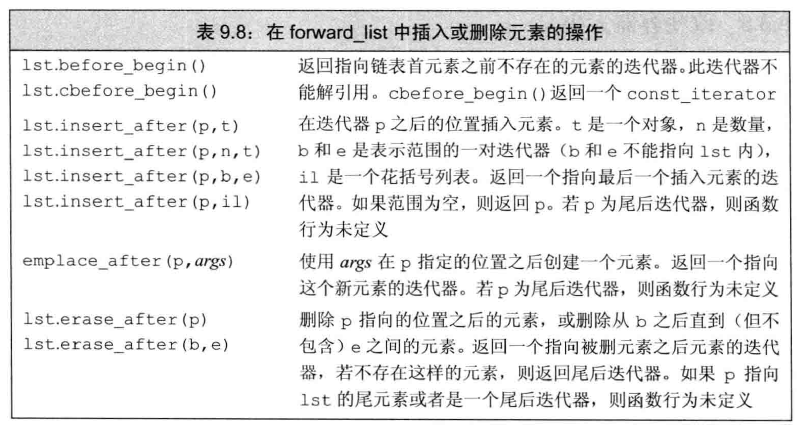

# 1 单向链表 list

链表中的元素是存储在非连续的内存空间中的，数据元素的逻辑顺序是通过链表中的指针链接实现的

链表的数据结构是由一个个结点组成的，每个结点包含一个**数据域**和一个指向下一个结点地址的**指针域**

链表的优点：

- 采用动态存储分配，不会造成内存浪费和溢出
- 插入和删除操作十分方便，移动指针即可，不需要移动大量元素

链表的缺点：

- 不支持快速随机访问，访问元素时需要遍历整个链表

# 2 双向链表 forward_list

双向链表的数据结构也是由一个个结点组成，每个结点包含一个**数据域**、一个**指向下一个结点地址的指针域**和一个**指向前一个结点的指针域**

因此在插入和删除的操作上，和其他容器有所不同

