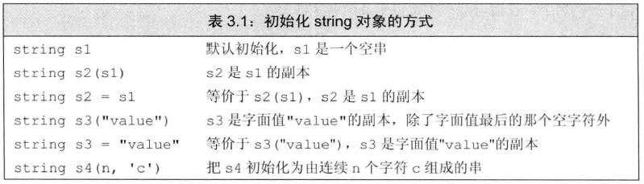
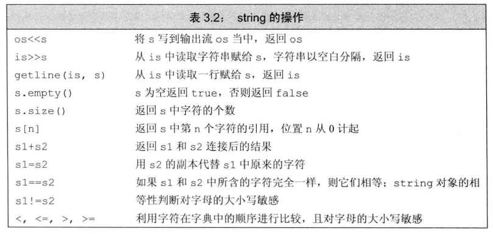
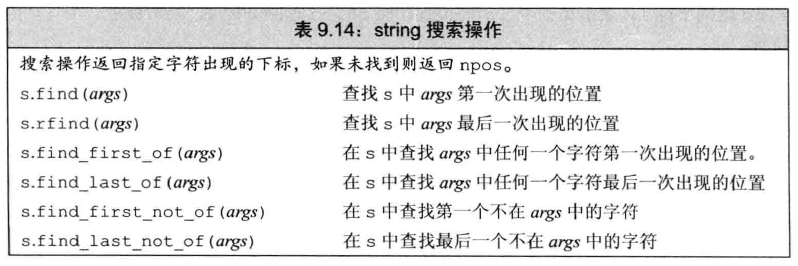
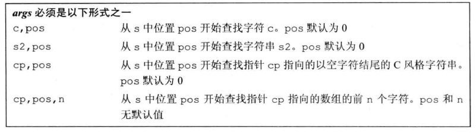
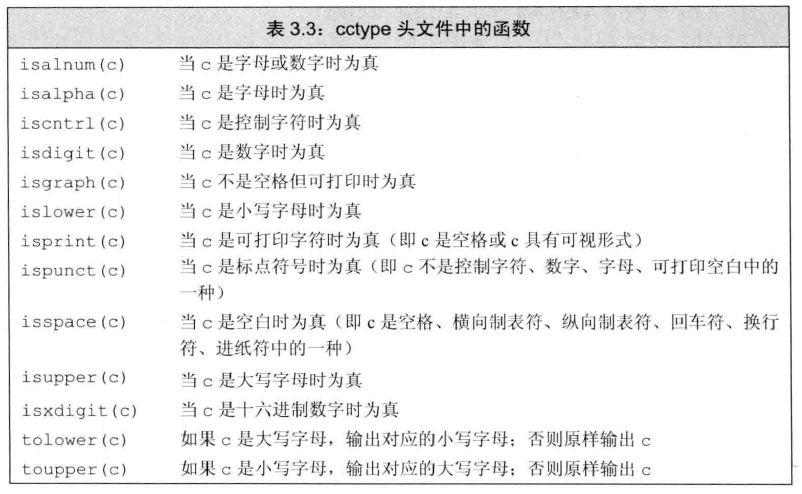
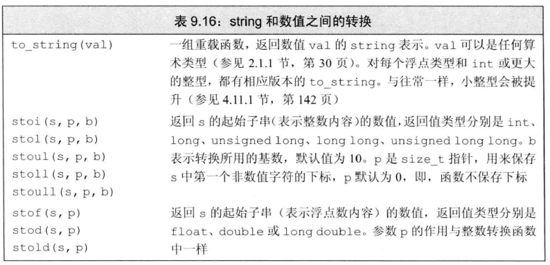
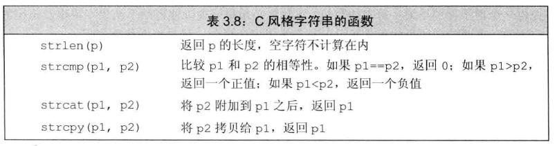

# 1 定义和初始化string

string也是STL容器，表示可变长的字符序列，使用是需要包含头文件`<string>`，并使用命名空间：

```c++
#include<string>
using std::string
```





# 2 string的基本操作




# 3 string的常用函数

## 3.1 拼接字符串

```c++
string str3 = "I";
str3.append(" love "); // 将字符串添加到str3结尾
str3.append("game abcde", 4); // 把字符串的前4个字符连接到str3结尾
str3.append("hello world", 4, 3); // 从下标4位置开始 ，截取3个字符，拼接到字符串末尾
```


## 3.2 查找与替换

**函数原型：**

>  查找






> 替换

* `string& replace(int pos, int n, const string& str); `       //替换从pos开始n个字符为字符串str
* `string& replace(int pos, int n,const char* s); `                 //替换从pos开始的n个字符为字符串s


**总结：**

* find查找是从左往后，rfind从右往左
* find找到字符串后返回查找的第一个字符位置，找不到返回-1
* replace在替换时，要指定从哪个位置起，多少个字符，替换成什么样的字符串


## 3.3 字符串比较

**比较方式：**

* 字符串比较是按字符的ASCII码进行对比

= 返回   0

\> 返回   1 

< 返回  -1


**函数原型：**

* `int compare(const string &s) const; `  //与字符串s比较
* `int compare(const char *s) const;`      //与字符串s比较


## 3.4 获得子串

**函数原型：**

* `string substr(int pos = 0, int n = npos) const;`   //返回由pos开始的n个字符组成的字符串

```c++
string s = "hello world";
string s2 = s.substr(0, 5); // s2 = hello
string s3 = s.substr(6);	// s3 = world
```


# 4 处理string对象中的字符

以下函数都是包含在`<cctype>`头文件中的：



一般的，使用for语句来处理string中的每个字符

```c++
string s = "Hello World!!";
for(auto& c:s)
    c = toupper(c);
```


## 4.1 string和数值之间的转化



```c++
int i = 42;
string s = to_string(i);	// 将整数i转换为字符表示形式
double d = stod(s);			// 将字符串s转换为浮点数

stirng s2 = "pi = 3.14";
d = stod(s2.substr(s2.find_first_of("+-.0.123456789"))); // d = 3.14
```


# 5 C风格的字符串

C风格的字符串不是C++中的string数据类型，而是指存放在==字符数组==中的字符串，且以**空字符**结束

空字符结束是指：在字符串最后一个字符后面跟着一个`\0`，这个空字符占用内存空间


C++兼容了C中的string，使用C风格的字符串函数时，需要包含头文件`<cstring>`



举个例子来说明以下C++的string和C风格的字符串的区别：

```c++
#include<iostream>
#include<string>
using namespace std;

int main()
{
    string ch1 = "hello";
    //char* p = ch1; // 错误，无法用指针指向string类型
    const char* p1 = ch1.c_str(); // 需要用c_str()将string转换为字符数组

    char ch2[] = "hello";
    char* p2 = ch2;
    return 0;
}
```

在C++中，string对象无法使用指针直接获取首地址，需要使用函数`c_str()`将其转换为C风格的字符串

