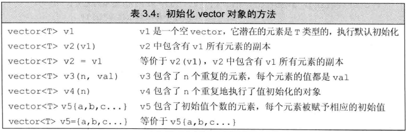
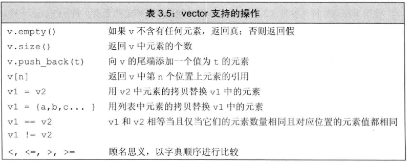

# 1 vector

vector表示对象的集合，其中所有对象的数据类型都相同，集合中的每个对象都有一个与之对应的索引，索引用于访问对象

可以把vector近似当成数组，二者最主要的区别是：vector是动态扩展的，数组是固定的

vector实质是一个类模板，要使用类模板时，需要显式指定对象的数据类型


# 2 定义和初始化vector

T 为对象的数据类型，T也可以是一个容器对象



**注意**：第4行和最后2行，当T是**string**类型时，使用`()`和使用`{}`的区别：

`vector<string> v1{"h1"}`：v1有一个元素

`vector<string> v2("h1")`：错误，`（）`中不能使用字符串

`vector<string> v3{10}`：v3有10个string对象

`vector<string> v4{10, "h1"}`：v4有10个“h1”元素


**特殊情况：**使用数组初始化vector对象

```c++
int arr[] = {0,1,2,3,4};
// vi有5个元素，分别是arr中对应元素的副本
vector<int> vi(begin(arr), end(arr));
```


# 3 vector常用操作



**注意**：可以用下标的方式访问vector元素，但是不能使用下标方式添加元素，只能使用push_back方式进行添加


## 3.1 管理容量

为了支持快速随机访问，这三种容器中的元素是连续存储——内存空间是连续的

考虑向vector或string中添加元素，如果没有空间容纳新元素，容器不可能将这个新元素添加到内存中的其他位置，因为前提要求是==元素的物理地址必须是连续的==

因此，做法就是重新分配一整块大的内存地址，将当前的所有元素和新元素移动到新的内存中，再释放原有的内存空间

由此可以看出，如果每次添加新元素都这样**大动干戈**，就会使得效率降低


**为了避免这种代价，STL为vector和string分配了比原本需要的空间更大一些的空间，多出来的一部分内存空间作为预留，以便将来添加新元素时使用，这样就不必每次都重新分配内存了**


capacity是指：在不分配新的内存空间的前提下，容器最多可以保存多少元素

- `v.shrint_to_fit()`：将capacity减少到与size相同大小，**只能用在vector, string, deque**

- `v.capacity()`：返回容器的容量，**只能用在vector、string**

- `v.reverse(n)`：分配至少能容纳n个元素的内存空间，**只能用在vector、string**

  作用：减少vector在动态扩展容量时的扩展次数；如果数据量较大，可以一开始利用reserve预留空间


思考：为什么list或array没有capacity成员函数？

list：链表，内存空间不是连续的

array：数组，一旦初始化，内存空间是固定的，无法动态扩充


# 4 数组

与vector不同，数组的大小是确定不变的，不能随意增加元素


## 4.1 定义和初始化数组

对于一个字符串，默认有一个空字符`'\0'`

定义字符数组有以下几种情况：

- `char a1[] = {'C', '+', '+'};`
- `char a2[] = {'C', '+', '+', '\0'};`
- `char a3[] = "C++";`
- `char a4[3] = "C++";`


```c++
#include<iostream>
#include<cstring>
using namespace std;

int main()
{
    char a1[] = {'C', '+', '+'};
    char a2[] = {'C', '+', '+', '\0'};
    char a3[] = "C++";
    //char a4[3] = "C++"; //报错，'\0'也占空间
    cout << " strlen(a1):"  << strlen(a1) << endl; //6 ？
    cout << " strlen(a2):"  << strlen(a2) << endl; //3
    cout << " strlen(a3):"  << strlen(a3) << endl; //3
    cout << " sizeof(a1)/sizeof(a1[0]):"
         <<  sizeof(a1)/sizeof(a1[0]) << endl; 	  //3
    cout << " sizeof(a2)/sizeof(a2[0]):"
         <<  sizeof(a2)/sizeof(a2[0]) << endl;    //4
    cout << " sizeof(a3)/sizeof(a3[0]):"
         <<  sizeof(a3)/sizeof(a3[0]) << endl;    //4
    return 0;
}
```

- strlen计算有效字符，不计算`\0`

- sizeof计算所有字符，包括空字符占用空间


## 4.2 获得数组指针

数组也有类似于迭代器的指针，可以使用标准库函数`begin()`和`end()`获得首元素指针和尾元素的下一个位置的指针

```c++
int a[] = {0,1,2,3};
int *head = begin(a);
int *tail = end(a);

*a：默认指向首元素地址
```


## 4.3 多维数组和指针

- `int *p[4]`：这是一个数组，整型指针的数组（这个数组存放的是整型指针）
- `int (*p)[4] = a`：这是一个指针，指向含有4个整数的数组a（`int a[3][4]`）

- `int *p = b`：这是一个指针，指向一维数组b（`int b[3]`）


```c++
#include<iostream>
using namespace std;

int main()
{
    char ch[][5] = {"agc", "efg"};
    
    cout << ch << endl;     //0x7ffd1adbdd1e
    
    cout << &ch[0] << endl; //0x7ffd1adbdd1e
    
    char **c = (char**)ch;
    cout << c << endl;      //0x7ffd1adbdd1e
    
    char (*p)[5] = ch;    
    cout << p << endl	    //0x7ffd1adbdd1e
    return 0;
}
```

