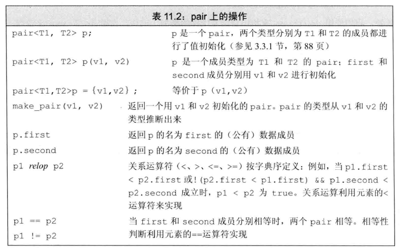
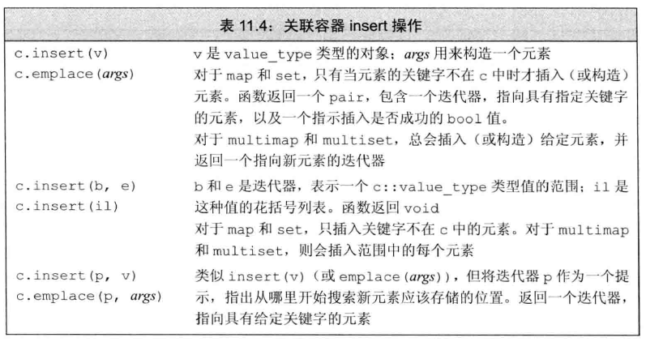
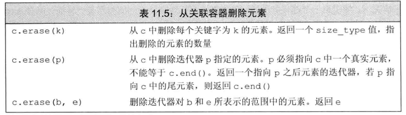
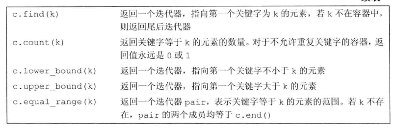

# 1 set\multiset

头文件：`<set>`

## 1.1 set

- set中每个元素只包含一个关键字，不可重复
- set支持高效的关键字查询操作（检查一个给定的关键字是否在set中）
- 所有元素都会在插入时自动被排序

构造：

* `set<T> st;`                        //默认构造函数：
* `set(const set &st);`       //拷贝构造函数

赋值：

* `set& operator=(const set &st);`    //重载等号操作符

大小和交换：

- `size()`：返回容器中元素的数目
- `empty()`：判断容器是否为空
- `sawp(a, b)`：交换

## 1.2 multiset

**set与multiset的区别：**

* set不可以插入重复数据，而multiset可以
* set插入数据的同时会返回插入结果，表示插入是否成功
* multiset不会检测数据，因此可以插入重复数据

## 1.3 迭代器

==set的迭代器是const类型==，因此迭代器读取的元素值可读不可写

# 2 pair 类型

头文件：`<utility>`

功能：保存两个数据成员，类似一个含有两个成员变量的结构体

# 3 map\multimap

头文件：`<map>`

## 3.1 map

**简介：**

* map中所有元素都是pair
* pair中第一个元素为key（键值），起到索引作用，第二个元素为value（实值）
* 所有元素都会根据元素的键值自动排序

**本质：**

* map/multimap属于**关联式容器**，底层结构是用二叉树实现。

**优点：**

* 可以根据key值快速找到value值

**构造：**

* `map<T1, T2> mp;`                     //map默认构造函数: 
* `map(const map &mp);`             //拷贝构造函数

**赋值：**

* `map& operator=(const map &mp);`    //重载等号操作符

大小和交换：

- `size()`：返回容器中元素的数目
- `empty()`：判断容器是否为空
- `sawp(a, b)`：交换

## 3.2 multimap

map和multimap**区别**：

- map不允许容器中有重复key值元素
- multimap允许容器中有重复key值元素

# 4 插入元素

# 5 删除元素

# 6 访问、查找、统计元素

