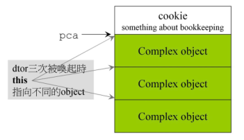
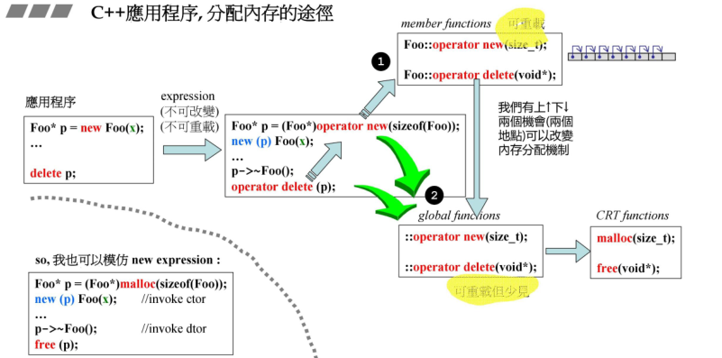

# new/delete 和 malloc/free 的区别

- 1、`new/delete`是`C++`的==关键字==，而`malloc/free`是==库函数==，`new/delete`可以进行重载，而`malloc/free`不行；
- 2、`new`时不需要指定空间大小，但是需要指定分配对象类型，返回的也是该类型的指针；而`malloc`时需要指定空间大小，无需指定数据类型，返回的是`void *`泛型指针；
- 3、`new`失败时直接抛异常，而`malloc`则是返回`NULL`。
- 4、`new`时会先调用`malloc`，然后调用所分配对象的构造函数进行构造；
- 5、`new`操作符是==从自由存储区上为对象动态分配内存空间的==，`malloc`函数是==从堆上动态分配内存==。`自由存储区`是`C++`基于`new`操作符的一个抽象概念， ==凡是通过new操作符进行内存申请的， 该内存称为自由存储区==。 而自由存储区的位置取决于`operator new`的实现细节。==自由存储区不仅可以是堆， 也可以是静态存储区==， 取决`operator new`在哪里为对象分配内存。
- 6、使用`malloc`分配的内存后，如果在使用过程中发现内存不足，可以使用`realloc`函数进行内存重新分配实现内存的扩充。`realloc`先判断当前的指针所指内存是否有足够的连续空间，如果有，原地扩大可分配的内存地址，并且返回原来的地址指针；如果空间不够，先按照新指定的大小分配空间，将原有数据从头到尾拷贝到新分配的内存区域，而后释放原来的内存区域。new没有这样直观的配套设施来扩充内存。


**主要介绍C++分配内存的基本工具**

|           分配           |           释放            |              类型               |         可否重载         |
| :----------------------: | :-----------------------: | :-----------------------------: | :----------------------: |
|         malloc()         |          free()           |             C库函数             |           不可           |
|           new            |          delete           | C++运算符表达式(new expression) |           不可           |
|     ::operator new()     |    ::operator delete()    |             C++函数             |            可            |
| allocator<T>::allocate() | allocate<T>::deallocate() |            C++标准库            | 可自由设计并搭配任何容器 |

```c++
#include <iostream>
using namespace std;

int main(int argc, char const *argv[])
{
    void *p1 = malloc(512); //分配 512 bytes
    free(p1);

    int *p2 = new int;  //分配 int 类型的空间
    delete p2;

    void *p3 = ::operator new(512); //分配 512 bytes
    ::operator delete(p3);

    //在GCC下使用分配器分配空间
    void *p4 = allocator<int>().allocate(7);    //创建一个int类型的临时对象，并分配7个int单元
    allocator<int>().deallocate((int *)p4, 7);  //删除分配器分配的空间

    cout << "done !" << endl;

    return 0;
}
```


# operator new/delete

实质是一个C++函数，内部调用的是`malloc/free`来实现内存的分配/释放

```c++
void *operator new(size_t size, const std::nothrow_t&)_THROW0()
{
    void *p;
    while((p=malloc(size))==0)	//循环调用malloc分配内存，如果成功返回0，跳出循环
    {
        _TRY_BEGIN
            //如果malloc失败，则调用自定义的内存释放函数 _callnewh()
            if(_callnewh(size)==0) break;
       	_CATCH(std::bad_alloc) return 0;
        _CATCH_END
    }
    return p;
}

void __cdecl operator delete(void *p)_THROW0()
{
    free(p);
}
```


# new/delete

==new其实就是告诉计算机开辟一段新的空间==，但是和一般的声明不同的是，==new开辟的空间在堆上==，而一般声明的变量存放在栈上。

通常来说，**当在局部函数中new出一段新的空间，该段空间在局部函数调用结束后仍然能够使用，可以用来向主函数传递参数**。

另外需要注意的是，new的使用格式：==new出来的是一段空间的首地址。所以一般需要用指针来存放这段地址。==

使用实例：

```c++
int *p1 = new int;		//分配一个int类型的空间，p1指向这块空间
int *p2 = new int(3); 	//p2指向整数为3的这块空间
delete p2;

class A{...};	//声明一个类A
A *obj = new A();	//分配类A的空间，obj指向这块空间，并在这块空间上调用构造函数
delete obj;			//首先调用类A的析构函数，然后释放这块空间	

struct student	//声明一个结构体student
{
  string name;
  int score;
};
 
student *stu2 = new student;	//分配一个student结构体空间，stu2指向这块空间
stu2->name = "Jon";
stu2->socre = 100;
delete stu2;
```


==new有两个动作：==

- 1、在堆上分配内存空间
- 2、在此空间上调用构造函数

```C++
Complex *pc = new Complex(1, 2);
```

**编译器转换为↓：**

```c++
Complex *pc;
try
{
    void *mem = operator new(sizeof(Complex));	//1、调用operator new函数分配内存
    pc = static_cast<Complex*>(mem);	//将mem强转为Complex类型指针
    pc->Complex::Complex(1, 2);			//2、调用构造函数
}
catch(std::bad_alloc)
{
    //若分配失败则抛出异常
}
```


==delete有两个动作：==

- 1、调用析构函数
- 2、释放内存

```c++
delete pc;
```

**编译器转换为↓：**

```c++
pc->~Complex();			//1、调用析构函数
operator delete(pc);	//2、调用operator delete函数释放内存
```


**注意：在GCC下编写代码时，构造函数不能直接被指针调用；析构函数能被指针调用**

如果想直接调用构造函数，使用**placement new**

```c++
Complex *pc;
new (pc)Complex(1, 2);		//直接调用构造函数，分配空间设置初值
```


## placement new

==作用：将一个对象建构在一个已经分配好的内存中==（需要一个指针指向这个已经分配好的内存）

```c++
#include<new>
char *buf = new char[sizeof(Complex)*3];	//分配sizeof(Complex)*3个bytes
Complex *pc = new (buf)Complex(1, 2);	//将新的对象pc建构在buf指向的内存中
delete []buf;
```

**编译器转换为↓：**

```c++
Complex *pc;
try
{
    void *mem = operator new(sizeof(Complex), buf);	//1、在buf中重新分配大小
    pc = static_cast<Complex*>(mem);	//转型
    pc->Complex::Complex(1, 2);	//2、调用构造函数
}
catch(std::bad_alloc)
{
    //若分配失败则抛出异常
}
```


# new [], delete []

内部实质使用的还是`malloc`和`free`

在分配数组空间时，会携带一个`cookie`，记录了每一个数组元素的大小



使用实例：

```c++
int *p3 = new int[5];	//分配一个int类型的数组空间，p3指向这块空间
delete []p3;			//删除数组空间

//结构体数组
student *stu1 = new student[2]{{"Bob", 90}, {"Mary", 88}};	//分配结构体数组空间，并赋值 
delete []stu1;

//类
Complex *pca = new Complex[3];	//调用3次构造函数，生成3个对象，pca指向这个数组
delete []pca;	//调用3次析构函数，再释放内存
```


# 小结1：调用流程

> 应用程序，用户直接使用new来分配内存

```c++
Foo *p = new Foo(x);
delete p;
```

> 在编译过程中，编译器将new转换为调用C++函数 operator new/delete

```c++
Foo *p = (Foo*)operator new(sizeof(Foo));	//1、分配空间
new (p)Foo(x);	//2、placement new调用构造函数

p->~Foo();	//1、调用析构函数
operator delete(p);	//2、释放空间
```

> 查看operator new/delete源代码可知，内部实质调用的是malloc/free



有两个途径可以进行内存管理：

- ①`operator new`是可以重载的，用户可以在一个类中实现重载，从而实现自定义内存分配
- ②使用一般的`operator new`来进行自动管理


# 重载 ::operator new/delete

