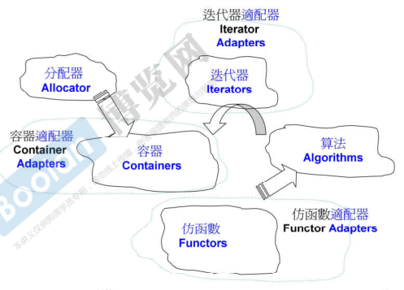

# STL六大部件

- **容器Containers**：实质是模板类
- 分配器Allocators：为容器分配内存，定义容器时默认指定了分配器，可以不显式书写
- **算法Algorithms**：提供的参数为迭代器的函数
- 迭代器Iterators：容器的泛化指针
- 适配器Adapters
- 仿函数Functors：用户自定义的函数

# 容器

## 顺序容器

- Array：固定大小的连续空间
- Vector：尾部可自动扩充
- Deque：双向队列，头尾可自动扩充
- List：双向链表
- ForwardList：单链表

## 关联容器

- Set/Multiset：集合/可重复集合，实质是由**红黑树**实现
  - Unordered（不定序） Set/Multiset：实质是由**链式哈希表**实现
- Map/Multimap：映射（key，value）/可重复映射
  - Unordered（不定序） Map/Multimap

# 分配器

- allocator<T>：默认分配器
- \_\_gnu_cxx::malloc_allocator<T>
- \_\_gnu_cxx::new_allocator<T>
- \_\_gnu_cxx::_\_pool_alloc<T>
- \_\_gnu_cxx::_\_mt_alloc<T>
- \_\_gnu_cxx::bitmap_allocator<T>