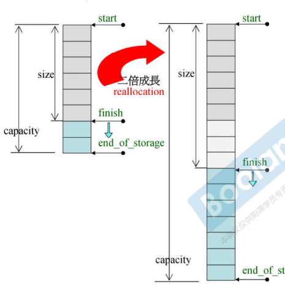
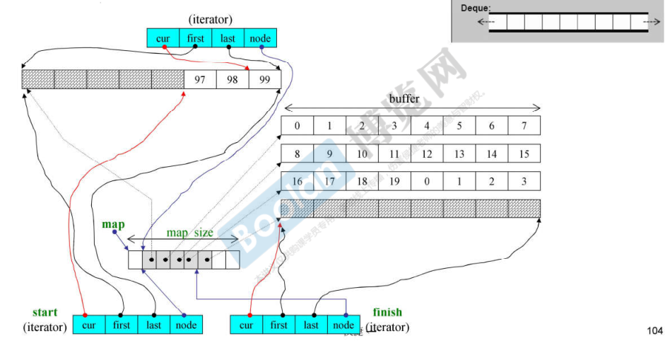

Linux下STL源码在`/usr/include/c++/9/bits`

# OOP & GP

- OOP（Object-Oriented Programming）
  - 一个类中有方法和属性
- GP（Generic Programming）
  - 类中的方法和属性是分开的，方法（算法）在外部实现，是全局的


# 基础 

`./C++基础/04类的高级用法.md`

## 操作符重载

## 模板

`./C++面向对象高级开发/03面向对象续.md`


# 分配器

实质调用`malloc`，`free`


# 容器

## list

实质：实现的是双向循环链表

size：8（两个指针）

class中存在：

- node：链表节点
- iterator：泛化指针（至少有5个typedef，重载指针运算符）

```c++
template<class T, class Alloc=alloc>
class list
{
protected:
    typedef __list_node<T> list_node;
public:
    typedef list_node* link_type;
    typedef __list_iterator<T, T&, T*> iterator;
protected:
    link_type node;
...
}

template<class T>
struct __list_node
{
    typedef void* void_pointer;
    void_pointer prev;
    void_pointer next;
    T data;
}

// 迭代器
template<class T, class Ref, class Ptr>
struct __list_iterator
{
    typedef __list_iterator<T, Ref, Ptr> self;
    typedef __list_node<T>* link_type;
    
    // 声明迭代器相关类型，方便算法使用
    typedef bidirectional_iterator_tag iterator_category;
    typedef T	value_type;
    typedef Ptr	pointer;
    typedef Ref reference;
    typedef ptrdiff_t difference_type;
    
    link_type node;
    
    /*重载运算符*/
...
}
```


## vector

实质：动态数组，连续空间

==对于连续空间的容器，迭代器是一般指针==

size为[start, finish]，备用空间为[finish, end_of_storage]，当超过备用空间时，需要进行扩充时，在内存空间中找到两倍大的capacity空间，把原来的元素copy到新的内存空间



```c++
template<class T, class Alloc=alloc>
class vector
{
public:
    typedef T			value_type;
    typedef value_type* iterator;//迭代器是一般指针，使用萃取机供算法使用
    typedef value_type& iterator;
    typedef size_t		size_type;
protected:
    iterator start;
    iterator finish;
    iterator end_of_storage;
public:
    iterator begin() { return start; }
    iterator end() { return finish; }
    size_type size() const
    { return size_type(end()-begin()); }
    size_type capacity() const
    { return size_type(end_of_storage-begin()); }
    bool empty() const { return begin()==end(); }
    reference operator[](size_type n) { return *(begin() + n); }
    reference front() { return *begin(); }
    reference back() { return *(end()-1); }
}
```


## array

实质：固定大小的数组，连续空间

==对于连续空间的容器，迭代器是一般指针==


## deque

实质：双向动态数组，空间是**分段连续**的

size：40（两个迭代器，map，map_size）

定义一个deque，在内存中申请一块空间

迭代器是泛化指针

- cur：当前元素地址
- first：当前buffer的起始地址
- last：当前buffer的结束地址
- node：用于控制分段的map地址

map是一个vector，存放的是每段buffer的起始地址

insert时，先比较插入的位置离头或尾的距离，选择距离最小的再进行插入，以减少移动量

push_back时，如果空间不够，申请一块新的空间（buffer），把这个空间的首地址添加到map

push_front时，将申请的空间首地址添加到map


==迭代器操作符重载模拟连续空间：==

重载`-`：计算size，每个buffer的size*buffer的个数+当前buffer中元素个数（图中size=27）

重载`++`：判读cur是否到达buffer的尾部边界，改变node，指向下一个buffer的首地址

重载`--`：判断cur是否到达bufer的头部边界，改变node，指向前一个buffer的尾地址

重载`+=`，`-=`：判断计算后是否超过buffer的边界，如果超过，计算跨越的buffer个数，改变node，求余，指向正确的元素



```c++
template<class T, class Alloc=alloc, size_t BufSiz=0>
class deque
{
public:
    typedef T value_type;
    typedef __deque_iterator<T, T&, T*, BufSiz> iterator;
protected:
    typedef pointer* map_pointer;	//T**
protected:
    iterator start;
    iterator finish;
    map_pointer map;
    size_type map_size;
public:
    iterator begin() { return start; }
    iterator end() { return finish; }
    size_type size() const { return finish - start; }
...
}

// 迭代器
template<class T, class Ref, class Ptr, size_t BufSiz>
struct __deque_iterator
{
    // 声明迭代器相关类型，方便算法使用
    typedef random_access_iterator_tag iterator_category;//迭代器类型
    typedef T	value_type;
    typedef Ptr	pointer;
    typedef Ref reference;
    typedef ptrdiff_t difference_type;
    
    typedef size_t size_type;
    typedef T** map_pointer;
    typedef __deque_iterator self;
    
    T* cur;
    T* first;
    T* last;
    map_pointer node;
    
    /*重载运算符*/
...
}
```


## rb_tree

实质：红黑树（平衡二元搜索树），树的节点由value（key+data）组成

遍历方式：先序遍历

迭代器：begin()指向最左元素，end()指向最右元素

两种insert方法：

- `insert_unique`：节点key唯一
- `insert_equal`：节点key不唯一

```c++
// KeyOfValue，从Value中取出Key的函数
// Compare，Key比较大小的函数
template<class Key, class Value, class KeyOfValue, class Compare, class Alloc=alloc>
class rb_tree
{
    typedef __rb_tree_node<Value> rb_tree_node;	//rb_tree节点（parent, left, right）
    ...
public:
    typedef rb_tree_node* link_type;
protected:
    size_type node_count;	//rb_tree节点个数
    link_type header;		//根节点
    Compare key_compare;	//节点比较大小的函数
}

// G2.9使用rb_tree
rb_tree<int, int, identity<int>, less<int>, alloc> myTree;
```


## set/multiset

实质：集合，内部默认有一个rb_tree作为底部结构

使用rb_tree的方法来实现set

set/multiset只有key，即key=value，无法使用迭代器修改key

set中key不可重复，调用`insert_unique`

multiset中key可以重复，调用`insert_equal`

```c++
template<class Key, class Compare=less<Key>, class Alloc=alloc>
class set
{
public:
	typedef Key key_type;
    typedef Key value_type;
    typedef Compare key_compare;
    typedef Compare value_compare;
private:
    typedef rb_tree<key_type, value_type, identity<value_type>, key_compare, alloc> rep_type;
public:
    typedef typname rep_type::const_iterator iterator;	//const迭代器，不允许修改
}

set<int> iset;
```


## map/multimap

实质：映射，内部默认有一个rb_tree作为底部结构

使用rb_tree的方法来实现map

map/multimap有key，data，无法使用迭代器修改key但可以修改data

map中key不可重复，调用`insert_unique`

multimap中key可以重复，调用`insert_equal`

```c++
template<class Key, class T, class Compare=less<Key>, class Alloc=alloc>
class map
{
public:
	typedef Key key_type;
    typedef T 	data_type;
    typedef T	mapped_type;
    typedef pair<const Key, T> value_type;	//cosnt Key,不允许修改key
    typedef Compare key_compare;
private:
    typedef rb_tree<key_type, value_type, selectlst<value_type>, key_compare, alloc> rep_type;
public:
    typedef typname rep_type::iterator iterator;
}

map<int, string> imap;
```


**map独特的operator[]**

如果没有该元素，就插入这个元素；否则返回这个元素的data


## hashtable

实质：链式哈希表

当链表长度大于哈希表的大小，则将哈希表扩充至2倍（质数）并重新排列

```C++
//HashFcn，哈希表映射函数，将要存储的元素转换为哈希表下标
//ExtractKey，获取Key的函数
template<class Value, class Key, class HashFcn, class ExtractKey, class EqualKey, class Alloc=alloc>
class hashtable
{
public:
	typedef HashFcn hasher;
    typedef EqualKey key_equal;
    typedef size_t size_type;
private:
    hasher hash;
    key_equal equals;
    ExtractKey get_key;
    typedef __hashtable_node<Value> node;	//链表节点（val, next*）
    vector<node*, alloc> buckets;	//哈希表
    size_type num_elements;			//哈希表元素个数
public:
    size_type bucket_count() const {return buckets.size();}
};

// 迭代器
struct __hashtable_iterator
{
    node* cur;		//当前链表元素
    hashtable* ht;	//哈希表指针，用于找到哈希表的下一个元素
}

//使用hashtable
struct eqstr
{
    bool operator()(const char* s1, const char* s2) const
    {
        return strcmp(s1, s2)==0;
    }
}


hashtable<const char*, const char*, hash<const char*>, identity<const char*>, eqstr, alloc> ht(50, hash<const char*>(), eqstr());
```


## unorderd_set/multiset

实质：乱序集合，内部默认有一个hashtable作为底部结构

使用hashtable的方法来实现set


## unorderd_map/multimap

实质：乱序映射，内部默认有一个hashtable作为底部结构

使用hashtable的方法来实现map


# 容器适配器

使用其他容器来实现自身的特性

适配器不是容器，没有迭代器

## queue

实质：队列，内部默认有一个deque作为底部结构

使用deque的方法来实现先进先出


queue不可以使用vector作为底部结构（局部支持）：vector没有`pop_front()`方法

queue不可以使用set或map作为底部结构（局部支持）


```c++
template<class T, class Sequence=deque<T>>
class queue
{
public:
    typedef typename Sequence::value_type value_type;
    typedef typename Sequence::size_type size_type;
    typedef typename Sequence::reference reference;
    typedef typename Sequence::const_reference const_reference;
protected:
    Sequence c;	//底层容器
public:
    // 使用底层容器的方法实现queue
    bool empty() const {return c.empty();}
    ...
}
```


## stack

实质：栈，内部默认有一个deque作为底部结构

使用deque的方法来实现先进后出


stack也可以使用vector作为底部结构：vector拥有stack所需要的方法

```c++
stack<int, vector<int>> st;
```

stack不可以使用set或map作为底部结构


# 迭代器

定义迭代器时，必须提供5种迭代器相关类型，以便算法使用：

```c++
template<class _Tp>
struct _List_iterator
{
    typedef ptrdiff_t							difference_type;
    typedef std::bidirectional_iterator_tag		iterator_category;
    typedef _Tp									value_type;
    typedef _Tp*								pointer;
    typedef _Tp&								reference;
    ...
};

// 算法使用迭代器
template<typename I>
inline void algorithm(I first, I last)
{
    I::iterator_category;
    I::difference_type;
    I::value_type;
    I::pointer;
    I::reference;
}
```


## Traits 萃取机

`stl_iterator.h`

当算法使用一般的指针而不是迭代器（模板类）时，需要使用萃取作为中介

`iterator_traits`用以分离迭代器和一般指针

```c++
// 1，迭代器
template<class I>
struct iterator_traits
{
    typedef typename I::value_type 			value_type;
    typedef typename I::difference_type 	difference_type;
    typedef typename I::iterator_category	iterator_category;
    typedef typename I::pointer 			pointer;
    typedef typename I::reference 			reference;
}

// 2，一般指针
template<class T>
struct iterator_traits<T*> // 范围偏特化，限定参数类型
{
    typedef T 							value_type;
    typedef ptrdiff_t					difference_type;
    typedef random_access_iterator_tag	iterator_category;
    typedef T*							pointer;
    typedef T&							reference;
}

// 3，const指针
template<class T>
struct iterator_traits<const T*>
{
    typedef T 							value_type;	// 是T，而不是const T
    typedef ptrdiff_t					difference_type;
    typedef random_access_iterator_tag	iterator_category;
    typedef const T*					pointer;
    typedef const T&					reference;
}

// 算法使用迭代器or一般指针
template<typename I, ...>
inline void algorithm(...)
{
    typename iterator_traits<I>::value_type v1;
    // 如果I是迭代器，调用1
    // 如果I是一般指针，调用2
    // 如果I是const指针，调用3
}
```

