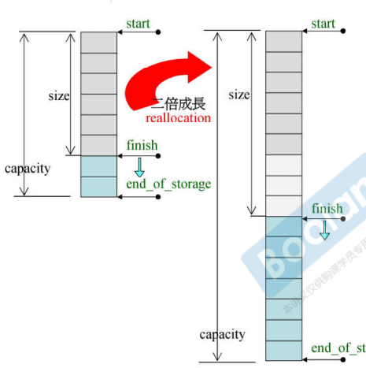
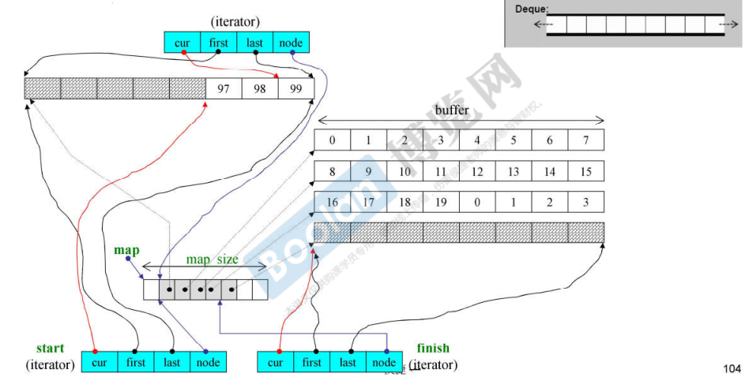

Linux下STL源码在`/usr/include/c++/9/bits`

# OOP & GP

- OOP（Object-Oriented Programming）
  - 一个类中有方法和属性
- GP（Generic Programming）
  - 类中的方法和属性是分开的，方法（算法）在外部实现，是全局的


# 基础 

`./C++基础/04类的高级用法.md`

## 操作符重载

## 模板

`./C++面向对象高级开发/03面向对象续.md`


# 分配器

实质调用`malloc`，`free`


# 容器

## list

实质：实现的是双向循环链表

size：8（两个指针）

class中存在：

- node：链表节点
- iterator：泛化指针（至少有5个typedef，重载指针运算符）


## vector

实质：动态数组，连续空间

==对于连续空间的容器，迭代器是一般指针==

size为[start, finish]，备用空间为[finish, end_of_storage]，当超过备用空间时，需要进行扩充时，在内存空间中找到两倍大的capacity空间，把原来的元素copy到新的内存空间



## array

实质：固定大小的数组，连续空间

==对于连续空间的容器，迭代器是一般指针==


## deque

实质：双向动态数组，空间是**分段连续**的

size：40（两个迭代器，map，map_size）

定义一个deque，在内存中申请一块空间

迭代器是泛化指针

- cur：当前元素地址
- first：当前buffer的起始地址
- last：当前buffer的结束地址
- node：用于控制分段的map地址

map是一个vector，存放的是每段buffer的起始地址

insert时，先比较插入的位置离头或尾的距离，选择距离最小的再进行插入，以减少移动量

push_back时，如果空间不够，申请一块新的空间（buffer），把这个空间的首地址添加到map

push_front时，将申请的空间首地址添加到map


==迭代器操作符重载模拟连续空间：==

重载`-`：计算size，每个buffer的size*buffer的个数+当前buffer中元素个数（图中size=27）

重载`++`：判读cur是否到达buffer的尾部边界，改变node，指向下一个buffer的首地址

重载`--`：判断cur是否到达bufer的头部边界，改变node，指向前一个buffer的尾地址

重载`+=`，`-=`：判断计算后是否超过buffer的边界，如果超过，计算跨越的buffer个数，改变node，求余，指向正确的元素




# 适配器

使用其他容器来实现自身的特性

适配器不是容器，没有迭代器

## queue

实质：队列，内部默认有一个deque作为底部结构

使用deque的方法来实现先进先出


queue不可以使用vector作为底部结构（局部支持）：vector没有`pop_front()`方法

queue不可以使用set或map作为底部结构（局部支持）

## stack

实质：栈，内部默认有一个deque作为底部结构

使用deque的方法来实现先进后出


stack也可以使用vector作为底部结构：vector拥有stack所需要的方法

```c++
stack<int, vector<int>> st;
```

stack不可以使用set或map作为底部结构


# 迭代器

定义迭代器时，必须提供5种迭代器相关类型，以便算法使用：

```c++
template<class _Tp>
struct _List_iterator
{
    typedef ptrdiff_t							difference_type;
    typedef std::bidirectional_iterator_tag		iterator_category;
    typedef _Tp									value_type;
    typedef _Tp*								pointer;
    typedef _Tp&								reference;
    ...
};

// 算法使用迭代器
template<typename I>
inline void algorithm(I first, I last)
{
    I::iterator_category;
    I::difference_type;
    I::value_type;
    I::pointer;
    I::reference;
}
```


## Traits 萃取机

`stl_iterator.h`

当算法使用一般的指针而不是迭代器（模板类）时，需要使用萃取作为中介

`iterator_traits`用以分离迭代器和一般指针

```c++
// 1，迭代器
template<class I>
struct iterator_traits
{
    typedef typename I::value_type 			value_type;
    typedef typename I::difference_type 	difference_type;
    typedef typename I::iterator_category	iterator_category;
    typedef typename I::pointer 			pointer;
    typedef typename I::reference 			reference;
}

// 2，一般指针
template<class T>
struct iterator_traits<T*> // 范围偏特化，限定参数类型
{
    typedef T 							value_type;
    typedef ptrdiff_t					difference_type;
    typedef random_access_iterator_tag	iterator_category;
    typedef T*							pointer;
    typedef T&							reference;
}

// 3，const指针
template<class T>
struct iterator_traits<const T*>
{
    typedef T 							value_type;	// 是T，而不是const T
    typedef ptrdiff_t					difference_type;
    typedef random_access_iterator_tag	iterator_category;
    typedef const T*					pointer;
    typedef const T&					reference;
}

// 算法使用迭代器or一般指针
template<typename I, ...>
inline void algorithm(...)
{
    typename iterator_traits<I>::value_type v1;
    // 如果I是迭代器，调用1
    // 如果I是一般指针，调用2
    // 如果I是const指针，调用3
}
```

